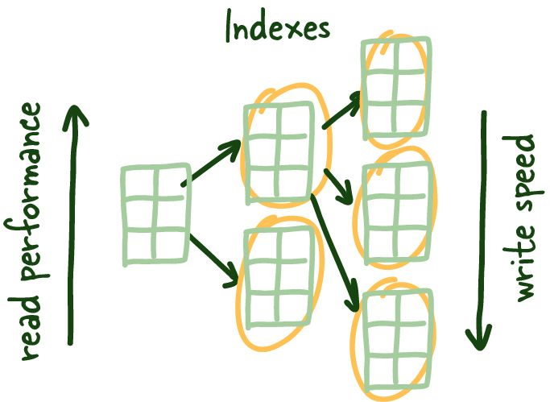
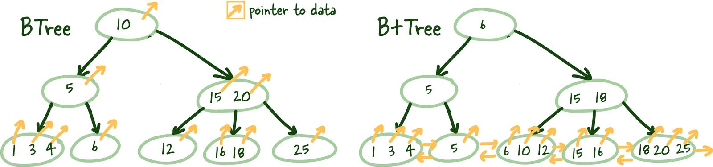

## Это первая статья из серии «Вещи, которые вы должны знать». Например, сегодня мы обсуждаем базы данных!

Часто бывает удивительно, как мало известно о том, как устроены базы данных внутри, учитывая, что они хранят почти все состояния наших приложений. Тем не менее, это знание основа общего успеха большинства систем. Итак, сегодня я объясню две наиболее важные темы при работе с индексами и транзакциями РСУБД.

Итак, не вдаваясь в подробности особенностей базы данных, я расскажу все, что вы должны понимать об индексах РСУБД. Я кратко коснусь транзакций и уровней изоляции и того, как они могут повлиять на ваши рассуждения о конкретных транзакциях.


## Что такое индекс

Индексы — это структура данных, которая помогает уменьшить время поиска запрошенных данных. Индексы достигают этого за счет дополнительных затрат на хранение, память и поддержание их в актуальном состоянии (более медленная запись), что позволяет нам пропустить утомительную задачу проверки каждой строки таблицы.

Подобно указателю в конце учебника, он помогает вам попасть на нужную страницу. Я не большой поклонник аналогии с книгой, она быстро разваливается, когда мы углубляемся в индексы базы данных, но это отличный способ представить тему.

## Зачем нужны индексы?

Небольшие объемы данных поддаются управлению, но (подумайте о списке посещаемости для небольшого класса), когда они становятся больше (подумайте о реестре рождений для большого города), они становятся менее управляемыми. Все, что раньше было быстрым, становится медленнее, слишком медленным.

Подумайте, как изменилась бы ваша стратегия, если бы вам пришлось искать что-то на 1 странице, а не на тысяче страниц имен. Нет, серьезно, остановись на секунду и подумай.

Независимо от того, что вы придумали, в какой-то базе данных реализованы почти все хорошие стратегии, которые вы можете придумать в какой-то момент. По мере роста системы собирают и хранят больше данных, что в конечном итоге приводит к описанной выше проблеме.

## Как индексы работают?



Таким образом, один из вопросов решения, который часто задается выше, заключается в том, чтобы логически хранить эти данные о том, как вы будете их искать. Это означает, что если вы хотите искать в списке по имени, вы должны отсортировать список по имени. Есть несколько проблем с этой стратегией. Я задам их в основном как вопросы для читателя здесь:

1. Что делать, если вы хотите искать данные несколькими способами?
2. Как бы вы справились с добавлением новых данных в список? Это быстро?
3. Как бы вы поступили с обновлениями?
4. Какая сложность алгоритма в этих задачах?  O(n), O(log n) ?

Независимо от вашей первоначальной стратегии, нам определенно нужен способ поддерживать порядок, чтобы мы могли быстро получать релевантные неупорядоченные данные (подробнее об этом позже).

Возьмем рисунок 1.1 ниже.

| id | name | city |
|:---|:-----|:-----|
|1   | Петров|Москва|
|2   | Иванов|Казань|
|3   | Сидоров|Екатеринбург|
|4   | Волков|Новосибирск|
|5   | Кочкин|Сочи|

Данные распределяются по хранилищу беспорядочно и распределяются случайным образом. В настоящее время большинство производственных серверов поставляются с SSD накопителями, но в некоторых случаях вам понадобятся обычные HDD, но, честно говоря, причин становится все меньше и меньше, поскольку цены на твердотельные накопители значительно снижаются.

Теперь чтение этого небольшого объема данных в память выполняется довольно быстро и относительно легко сканируется. Что, если данные, которые мы ищем, не могут быть полностью кэшированы в памяти? или время чтения всех данных с диска занимает слишком много времени?

| id | name | city |
|:---|:-----|:-----|
|1   | Петров|Москва|
|2   | Иванов|Казань|
|3   | Сидоров|Екатеринбург|
|4   | Волков|Новосибирск|
|5   | Кочкин|Сочи|
|...   | ...|...|
|100000   | Максимов|Тверь|
|100001   | Казаков|Вологда|


Итак, вот куда идет большинство разработчиков — я видел эту проблему раньше; нам нужен словарь (hash map) и способ добраться до конкретной строки, которую мы ищем, без необходимости сканировать медленный диск, считывая тонны блоков, чтобы увидеть, есть ли нужные нам данные.

Они называются **index leaf nodes**, которым дается определенный столбец для индексации, они могут хранить расположение соответствующих строк.


Эти index leaf nodes представляют собой сопоставление между индексированным столбцом и тем местом, где на диске находится соответствующая строка. Это дает нам быстрый способ добраться до определенной строки, если вы ссылаетесь на нее по индексированному столбцу. Сканирование индекса может быть намного быстрее, так как это компактное представление столбца, по которому вы ищете. Это экономит ваше время на чтение множества блоков в поисках запрошенных данных и гораздо удобнее кэшируется, что еще больше ускоряет весь процесс.

>Масштаб данных часто работает против вас, и сбалансированные деревья — первый инструмент в вашем арсенале против него.

INDEXES LEAF NODES имеют одинаковый размер, и мы пытаемся сохранить как можно больше таких конечных узлов в каждом блоке. Поскольку эта структура требует сортировки (логически, а не физически на диске), нам нужно решить проблему быстрого добавления и удаления данных; старый добрый связанный список (linked list) управляет этим, точнее, двусвязным списком.

Преимущество здесь двоякое: он позволяет нам читать конечные узлы индекса как вперед, так и назад и быстро перестраивать структуру индекса, когда мы удаляем или добавляем новые строки, поскольку мы просто модифицируем указатели — мощная штука.

Поскольку эти конечные узлы физически не расположены на диске по порядку (помните, что указатели поддерживают сортировку в двусвязном списке), нам нужен способ добраться до правильных конечных узлов индекса.

## Сбалансированные деревья (B-Trees)



Таким образом, вы можете задаться вопросом, где вы сделали серьезную ошибку, читая о **B-Trees**, которые вы ненавидели со школы. Я понимаю, что эти вещи скучны, но они важны и заслуживают понимания.

**B+Tree** позволяет нам построить древовидную структуру, в которой каждый промежуточный узел указывает на наивысшее значение узла соответствующих конечных узлов. Это дает нам четкий путь для поиска конечного узла индекса, который будет указывать на необходимые данные.

Эта структура строится снизу вверх, так что промежуточный узел покрывает все конечные узлы, пока мы не достигнем корневого узла наверху. Эта древовидная структура получила свое название «сбалансированная», потому что глубина одинакова по всему дереву.


## Логарифмическая масштабируемость

Я хочу немного отвлечься, чтобы показать всю силу этой структуры. Конечно, большинство разработчиков знают об экспоненциальном росте данных и, в идеале, оценок вашей компании. Но, к сожалению, масштаб данных часто работает против вас, и сбалансированные деревья — первый инструмент в вашем арсенале против него.

В зависимости от количества элементов, на которые могут ссылаться промежуточные узлы (M), плюс общая глубина дерева (N), мы можем ссылаться M на N объектов.

Вот таблица, иллюстрирующая концепцию со значением M, равным 5.

| Высота дерева | Листовые узлы индекса | 
|:---|:-----|
|3   | 125|
|4   | 625|
|5   | 3125|
|6   | 15625|
|7   | 78125|
|8   | 390625|
|9   | 1953125|


## Что такое транзакция?

**Транзакция** - последовательность команд SQL, которые должны быть выполнены полностью или не выполнены вообще.

Я бы сказал, что большинству систем не нужно управлять транзакциями вручную, но бывают ситуации, когда повышенная гибкость играет важную роль в достижении желаемого эффекта.

<details>
<summary>Что такое ACID</summary>
<br>
В computer science ACID (atomicity, consistency, isolation, durability) — это набор свойств транзакций базы данных, призванных гарантировать достоверность данных, несмотря на ошибки, сбои питания и другие сбои.

- **Atomicity**(атомарность) — выражается в том, что транзакция должна быть выполнена в целом или не выполнена вовсе.
- **Consistency**(согласованность) — гарантирует, что по мере выполнения транзакций, данные переходят из одного согласованного состояния в другое, то есть транзакция не может разрушить взаимной согласованности данных.
- **Isolation**(изолированность) — локализация пользовательских процессов означает, что конкурирующие за доступ к БД транзакции физически обрабатываются последовательно, изолированно друг от друга, но для пользователей это выглядит, как будто они выполняются параллельно.
- **Durability**(долговечность) — устойчивость к ошибкам — если транзакция завершена успешно, то те изменения в данных, которые были ею произведены, не могут быть потеряны ни при каких обстоятельствах.

Эти концепции, как правило, хорошо понятны, но их определения могут не совпадать от системы к системе в зависимости от системы базы данных. Поэтому обязательно ознакомьтесь с каждым из них для вашей производственной базы данных.
</details>

Транзакции могут быть выполнена автоматически, чтобы вы даже не знали, что они происходят, или вы можете создать их вручную следующим образом:

```sql
BEGIN;
SELECT * FROM people WHERE id =1;
COMMIT or ROLLBACK;
```
Мы сфокусируемся на времени между BEGIN и COMMIT или ROLLBACK и на том, что происходит с  другими транзакциями, воздействующими на те же данные.

<details>
<summary>COMMIT/ROLLBACK</summary>
<br>
Все ручные транзакции завершаются  COMMIT или ROLLBACK.

- **COMMIT** сохраняет изменения, сделанные текущей транзакцией.
- **ROLLBACK** отменяет изменения, сделанные текущей транзакцией.

Когда вы не управляете транзакциями вручную, если все запросы в транзакции успешно завершены, они фиксируются **COMMITED**. В случае какого-либо сбоя изменения во время этой транзакции они откатываются **ROLLBACK**, чтобы обеспечить атомарность всего действия.
</details>

## Read Phenomena

Представим ситуацию, когда в определенный момент времени с системой работают несколько пользователей. Естественно, операции транзакции в БД выполняются параллельно, чтобы ускорить работу системы. Но у параллельной работы транзакций есть свои подводные камни:

- Если операции транзакции взаимодействуют с разным набором непересекающихся данных, все работает корректно.
- Но что будет, если две и более операций транзакции в один момент времени начнут работать с одним и тем же набором данных? Возникнет явление, называемое race condition (состояние гонки).

Выделяют несколько эффектов, связанных с этим явлением:

### Non-repeatable reads

Эффект неповторяемого чтения возникает, когда транзакция считывает дважды одну и ту же строку, но каждый раз получает разные результаты.

> Например, по правилу согласованности клиент банка не может иметь отрицательный баланс на счёте. Транзакция А хочет уменьшить баланс счета клиента на 200 денежных единиц. Она проверяет текущее значение суммы на счёте — 500 денежных единиц. В это время транзакция В уменьшает сумму на счёте до 0 и фиксирует изменения. Если бы транзакция А повторно проверила сумму, то получила бы 0 денежных единиц, но на основе первоначальных данных она уже приняла решение уменьшить значение, и счет уходит в минус.


Как показано на изображении выше, non-repeatable reads( неповторяющиеся чтения) происходят, если вы не можете получить согласованное представление данных между двумя последовательными чтениями во время транзакции. В определенных режимах возможна одновременная модификация базы данных, и могут быть сценарии, в которых значение, которое вы только что прочитали, может быть изменено, что приведет к неповторяемому чтению.

### Dirty reads

**Эффект грязного чтения** возникает, когда транзакция считывает данные, которые еще не были зафиксированы.

>Представим, что транзакция А переводит все деньги клиента на другой счет, но не фиксирует изменения. Транзакция В считывает изменения счёта А, получает 0 денежных единиц на счете и отказывает клиенту в выдаче наличных. Транзакция А прерывается и отменяет перевод между счетами.


Точно так же грязное чтение происходит, когда вы выполняете чтение, а другая транзакция обновляет ту же строку, но не фиксирует работу, вы выполняете другое чтение и можете получить доступ к незафиксированному (грязному) значению, которое не является устойчивым состоянием. измениться и не согласуется с состоянием базы данных.

### Phantom reads

**Эффект чтения фантомов** возникает, когда набор данных соответствует условиям поиска, но изначально не отображается.

>Например, правило согласованности запрещает иметь клиенту более 3 лицевых счетов. Для открытия нового счета транзакция А проверяет все счета клиента банка и в результате получает 2 счета. В этот момент транзакция B открывает еще один счет клиенту и фиксирует изменения (3 счета). Если бы транзакция А повторно проверила количество лицевых счетов клиента, то их оказалось бы 3, и по правилу согласованности открытие нового счета было бы невозможно.


Фантомные чтения — это еще один феномен  чтения, который чаще всего возникает, когда вы имеете дело с агрегатами. Например, вы запрашиваете количество клиентов в конкретной транзакции. Между двумя последующими чтениями другой клиент регистрируется или удаляет свою учетную запись (зафиксировано), в результате чего вы получаете два разных значения, если ваша база данных не поддерживает блокировки диапазона для этих транзакций.

<details>
<summary>Уровни блокировки</summary>
<br>

1. **Serialized Database Access**(Последовательный доступ к базе данных) - заставляет базу данных выполнять запросы один за другим, ужасный параллелизм, однако высочайший уровень согласованности.
2. **Table Lock**(блокировка таблицы ) закрывает таблицу для транзакции  немного лучше параллелизма, но одновременная запись в таблицу по-прежнему замедляется.
3. **Row Lock**(Блокировка строки) - блокирует строку, над которой вы работаете, даже лучше, чем блокировки таблицы, но если эта строка нужна нескольким транзакциям, им придется подождать.
</details>

### Isolation Levels

Для устранения данных эффектов на уровне баз данных предусмотрены уровни изоляции, или transaction isolation levels, которые так или иначе реализованы во многих СУБД.


### REPEATABLE READ

Это уровень изоляции, при котором транзакция не видит изменения данных, прочитанные ей ранее, однако способна прочитать новые данные, соответствующие условию поиска. Справляется с эффектами потерянного обновления, грязного чтения, неповторяемого чтения, остается эффект чтения фантомов.

Согласованное чтение не накладывает блокировок и считывает данные из снэпшота, который создается при первом чтении в транзакции. Таким образом, одинаковые запросы вернут одинаковый результат.

На рисунке выше, как только мы делаем наше первое чтение, это представление блокируется на время транзакции, поэтому все, что происходит вне контекста этой транзакции, не имеет значения, зафиксировано или иным образом.

### SERIALIZABLE

Это уровень изоляции, при котором каждая транзакция выполняется так, как будто параллельных транзакций не существует. Справляется со всеми перечисленными выше эффектами, поскольку база данных выполняет запросы один за другим, переходя из одного стабильного состояния в другое.

### READ COMMITTED

Это уровень изоляции, при котором параллельно исполняющиеся транзакции видят только зафиксированные изменения других транзакций. Справляется с эффектами потерянного обновления и грязного чтения, остаются эффекты неповторяемого чтения и чтения фантомов.

### READ UNCOMMITTED

В качестве альтернативы, уровень изоляции READ UNCOMMITTED не поддерживает блокировку транзакций и может видеть незафиксированные данные по мере их возникновения, что приводит к грязным чтениям. Кошмары... в некоторых системах.
