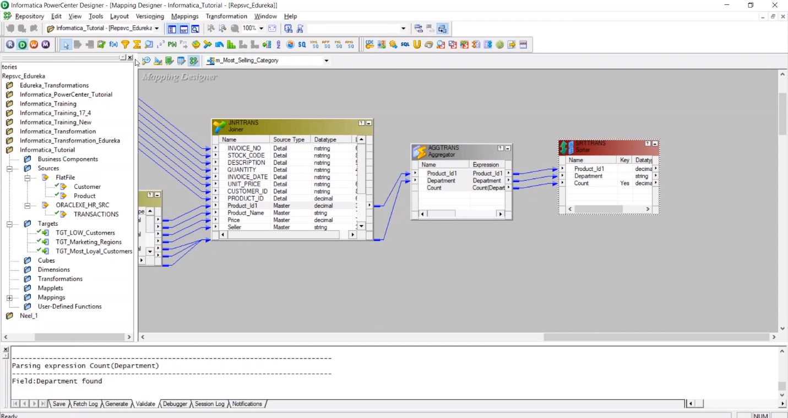
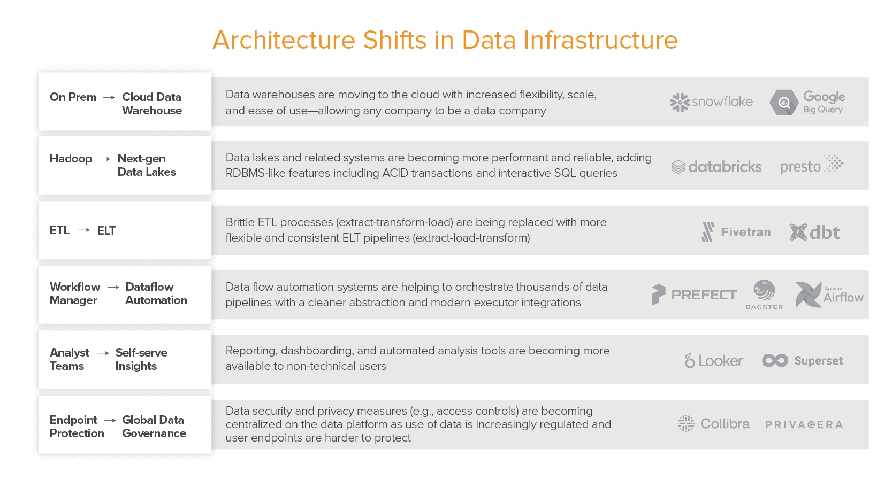

# Краткая история инструментов для оркестрации

Пока мы записываем данные с помощью компьютеров, мы автоматизируем процессы для обработки этих данных. Базовые понятия оркестровки, которым уже несколько десятков лет, такие как scheduler, job, workflow, переосмысливаются c появлением новых инструментов. Это краткая история инструментов, которые обеспечивают оркестрацию рабочих процессов.

## В начале был cron

[Cron](https://en.wikipedia.org/wiki/Cron) — это утилита командной строки, впервые представленная в 6 версии Unix, ранней версии операционной системы, которую сегодня используют многие компьютеры. Самая ранняя ссылка на него появляется в [man page](https://en.wikipedia.org/wiki/Man_page)  в 1974 году, в которой описывается его функция:

*Cron выполняет команды в указанные даты и время.*

Cron — простой планировщик. Можно представить его как повторяющееся напоминании, которое можно добавить в свой список дел. Используя cron, можно установить расписание на конкретном компьютере для периодического выполнения команды на этом же компьютере. В cron передается минимум аргументов - пять чисел, разделенных пробелами, за которыми следует выполняемая команда. Например, следующая команда будет печатать Happy New Year на терминале компьютера, на котором она запущена, каждый год в полночь 1 января:

Если вам не совсем понятно, как задавать расписание с помощью цифр, то вы не одиноки. Даже опытным разработчикам, использующим cron, часто приходится использовать шпаргалку для создания нового расписания или понимания существующего.
Cron по-прежнему широко используется. Хотя он не очень удобочитаем, он прост и универсален — он включен почти в каждый компьютер. Если все, что вам нужно сделать, это запустить один сценарий через регулярные промежутки времени, cron сделает свою работу.

## Затем пришли реляционные базы данных

Примерно в то же время, когда появился cron, появилась еще одна инновация — реляционные базы данных. Это была гораздо более сложная система, которая изменила бы вычисления и, соответственно, то, как планировалась повторяющаяся работа. Было несколько широко используемых реляционных баз данных, но самой ранней и самой долгоживущей коммерчески успешной базой данных является Oracle. Oracle v2, первая коммерчески доступная версия, была выпущена в 1979 году. В следующем десятилетии произошло быстрое распространение Oracle и подобных ему реляционных баз данных. Эти базы данных имели основные функции планирования, аналогичные cron.

В 1995 году Oracle представила *job queues*, описанные в примечаниях к выпуску 7.2 как:

*«Выпуск 7.2 предоставляет новую функцию, job queues, которая позволяет планировать периодическое выполнение кода PL/SQL».*

Руководство администратора Oracle7 описывает, как можно отправлять, удалять, изменять или запускать задания. Вместо того, чтобы просто создавать задание в тот момент, когда оно должно было начаться, DBMS_JOB сохраняла запись о следующем запуске каждого задания, позволяя инженерам видеть порядок выполнения заданий до их запуска. Эта запись также позволяла отслеживать задания с помощью простого SQL-запроса по мере их выполнения. В DBMS_JOB появились retry, которые позволяли повторит задание до 15 раз в случае сбоя. Если задание не удалось успешно выполнить, оно переходит в состояние «broken», но пользователи могут пометить задание как *not broken*, если захотят. Хотя DBMS_JOB был не  единственным инструментом в своем роде, он широко представлял инструменты того времени.

Хотя Oracle по-прежнему остается одной из самых популярных баз данных, используемой сегодня, DBMS_JOB  был заменен другим пакетом, DBMS_SCHEDULER, с аналогичными возможностями. Большинство инструментов хранения и обработки данных имеют что-то похожее. Если все ваши данные и вся обработка этих данных находятся в одном инструменте, стандартный планировщик может быть лучшим решением.

## Развитие хранилищ данных и интеграции данных

Oracle и ее конкуренты добились огромных успехов в обеспечении внедрения баз данных в конкретные приложения, такие как системы торговых точек. В конце концов, их клиенты столкнулись с несколькими разрозненными приложениями, каждое из которых имело собственную базу данных. Cron был планировщиком для одного компьютера, а DBMS_JOB — планировщиком для одной базы данных, но по мере того, как организации начали хранить и обрабатывать данные на нескольких компьютерах и базах данных, появился новый класс инструментов. Практика переноса данных из отдельных, часто специфичных для приложений баз данных в хранилище данных стала известна как интеграция данных .

Каждая база данных имеет особый способ организации данных, называемый схемой. Чтобы скопировать данные из «исходной» базы данных приложения в хранилище данных,  их необходимо было преобразовать из одной схемы в другую. Поскольку и исходная, и целевая базы данных были медленными и имели ограниченную емкость, это преобразование должно было происходить между ними, в самом инструменте интеграции данных. Таким образом, инструменты интеграции данных извлекали данные из исходной системы, преобразовывали и загружали в хранилище. Этот шаблон извлечения, преобразования, загрузки (ETL) стал настолько распространенным, что стал почти синонимом любого перемещения данных.

Первым и наиболее успешным коммерческим инструментом интеграции данных была Informatica. Компания Informatica, основанная в 1993 году, начала активно развиваться в 1998 году, представив свой продукт PowerCenter, который используется до сих пор.

PowerCenter был одним из первых инструментов, полностью предназначенных для управления заданиями. Он записывал метаданные об этих заданиях — когда какое задание выполнялось, сколько записей было обработано и т. д. Кроме того, это был один из первых инструментов, который представил концепцию «*source*», из которого поступали данные и  «*target*», в которую данные попадали, и «*workflow*», который их объединял.

Сегодня существует множество таких инструментов интеграции данных, все они имеют схожий шаблон, сформированный в основном за счет перемещения данных из одной или нескольких реляционных баз данных в хранилище данных на крупных предприятиях.

## Эпоха больших данных

В 2000-х хранилища данных все еще были ограниченными по емкости, относительно медленными и дорогими. В 2006 году Google открыл исходный код Hadoop, который популяризировал новый способ хранения и обработки данных. Вместо того, чтобы хранить все данные в одном хранилище, данные хранились на многих компьютерах в отдельных файлах. Примерно в 2011 году этот шаблон стал известен как ***DataLake***. DataLake были более простым и дешевым способом хранения данных, но их обработка была намного сложнее.

Имея опыт работы с cron и базами данных, инженеры начали создавать новый набор инструментов для оркестрации данных. Оркестраторы данных были предназначены для работы с Hadoop и подобными ему инструментами. Соответственно, они были вдохновлены его концепциями. Основные компоненты обработки данных Hadoop, MapReduce и YARN, организовали обработку данных как «задание», которое в свою очередь  должно было быть «DAGом» — направленным ациклическим графом .

[**Oozie**](https://github.com/apache/oozie) -  Yahoo открыли проект в 2010 году. Это был один из первых инструментов наиболее тесно связанный с Hadoop.

[**Luigi**](https://github.com/spotify/luigi)  - Spotify открыли проект  в 2012 году. Они описали Luigi как питоновский модуль предназначенный для построения сложных пайплайнов и пакетной передачи данных. Luigi поставляется со встроенной поддержкой Hadoop.

[**Azkaban**](https://github.com/azkaban/azkaban) был открыт Linkedin в 2014 году.  "*a batch workflow job scheduler, to run Hadoop jobs*"

[**Airflow**](https://github.com/apache/airflow) - airbnb открыли проект в 2015 году. На данный момент airflow самый популярный инструмент для оркестрации заданий.

Развитие оркестраторов данных привело к изменения в моделях внедрения инструментов.  Следующие поколения инструментов после cron были проприетарными. Такие инструменты, как Informatica, были разработаны для крупных компаний у которых много денег. Они были дорогими, и их было трудно заменить после развертывания, что создавало привязку к поставщику. Оркестраторы данных, напротив, были разработаны для инженеров. Они были бесплатными и с открытым исходным кодом. Это дало пользователям определенную свободу, стало возможным изменять и поддерживать инструменты самостоятельно.

## Modern Data Stack

Как раз в то время, когда инструменты эпохи Hadoop становились популярными, формировалась следующая волна инструментов.
В конце 2011 — начале 2012 года, на сцене появились первые облачные хранилища данных:

- Google Cloud Platform с BigQuery
- AWS c Readshift
- Snowflake только появился

Эти облачные хранилища данных, особенно Redshift, были намного дешевле и быстрее, чем существующие локальные хранилища данных. Вскоре люди начали использовать хранилища данных по-новому. Например, поскольку хранилища данных теперь могут легко преобразовывать данные, данные больше не нужно преобразовывать перед загрузкой в хранилище данных. Извлечение, преобразование, загрузка (ETL) превратилось в извлечение, загрузку, преобразование (ELT).

В конце 2013 — начале 2014 года, появились новые технологии обработки распределенных данных:

- Spark
- Kafka
- Presto

Эти инструменты предоставили более знакомые интерфейсы для работы с данными, такие как SQL, это сделало их более доступными и удобными в использовании. Они также  увеличили скорость и производительность обработки данных, что позволили обрабатывать данные почти в реальном времени, что стало известно как потоковая передача(streaming).

Эти события положили начало серии архитектурных изменений, которые происходят до сих пор. В статье Andreessen Horowitz's "[Emerging Architectures for Modern Data Infrastructure](https://future.a16z.com/emerging-architectures-for-modern-data-infrastructure-2020/)". многие из них представлены на одном слайде:

За последние пять лет слияние венчурного капитала и open-source продуктов привело к взрывному росту инструментов управления данными, которые мы стали называть современным стеком данных.

Когда появлялось новое поколение инструментов, оно не старалось заменить старый стэк. Вместо этого новый технологический "*стек*" был построен наряду с существующими. Сегодня во многих организациях есть простые задачи, запланированные с помощью cron и "*джобов*" в базе данных, а также "*workflow*" по интеграции данных, потоковая обработка и веб-службы с REST API. Современные инструменты(Modern Data Stack) должны работать со всеми этими системами.

Концепции, которые были полезны в предыдущем поколении инструментов, такие как DAG, теперь ограничивают возможности. Современные рабочие процессы динамичны, мультимодальны, асинхронны и быстры.
