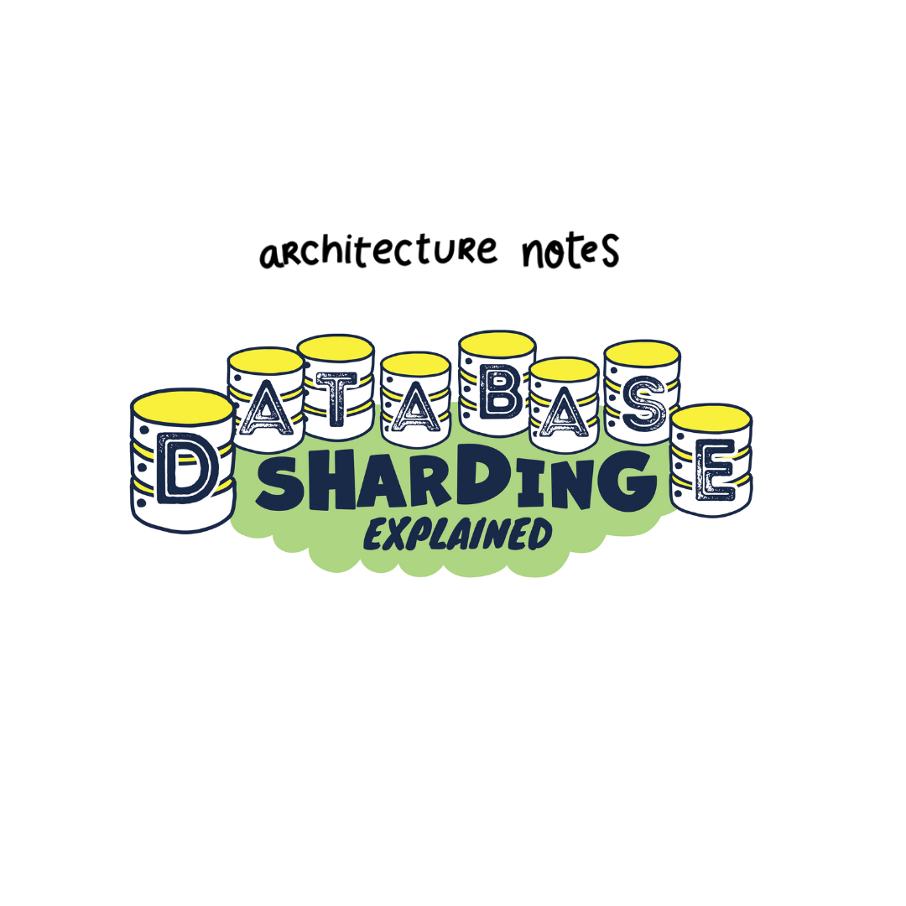
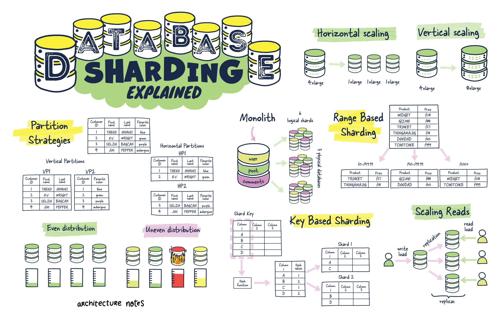
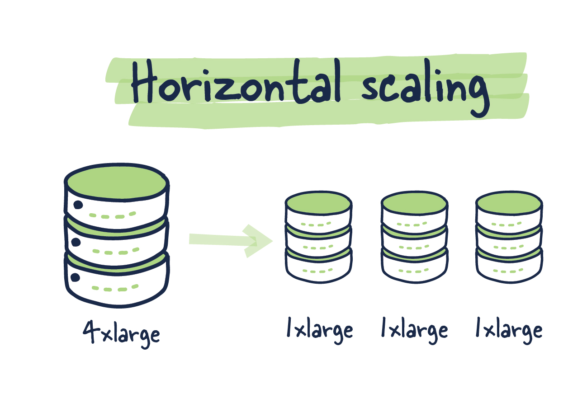
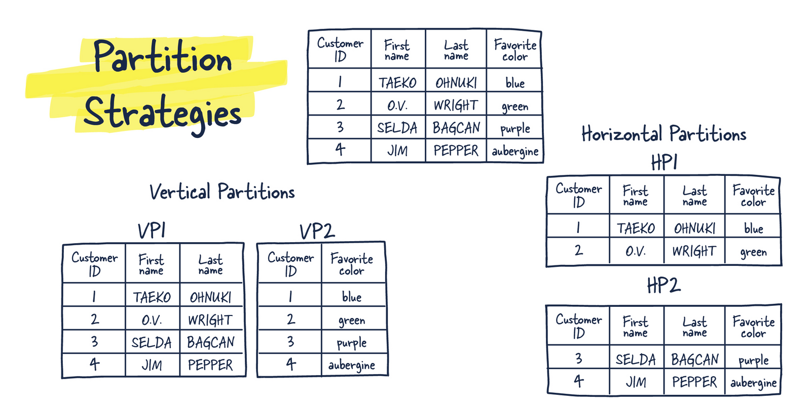
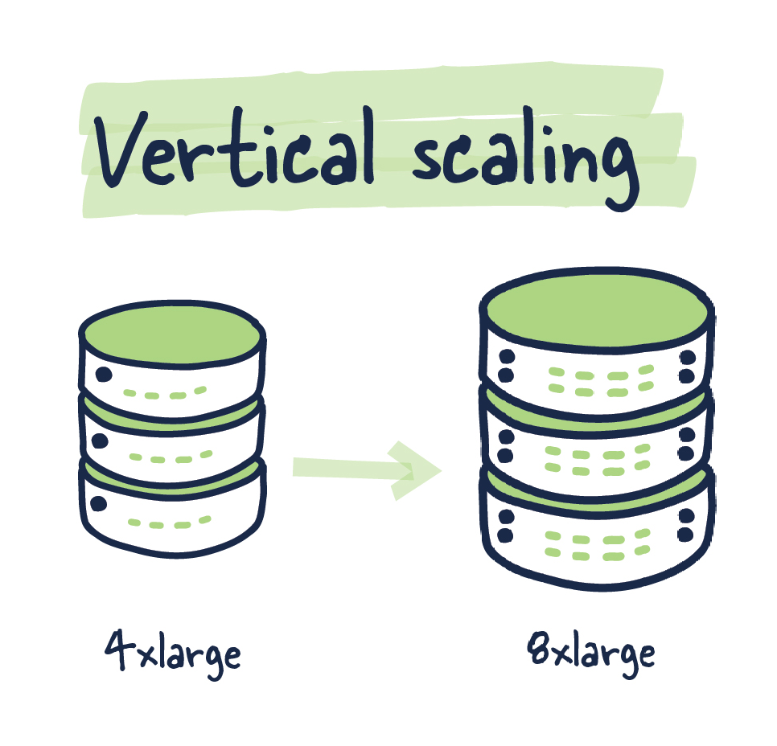
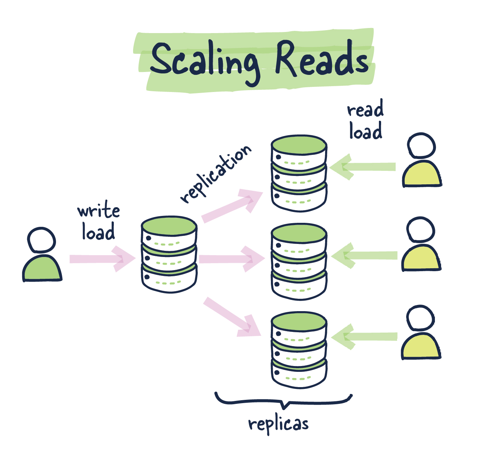
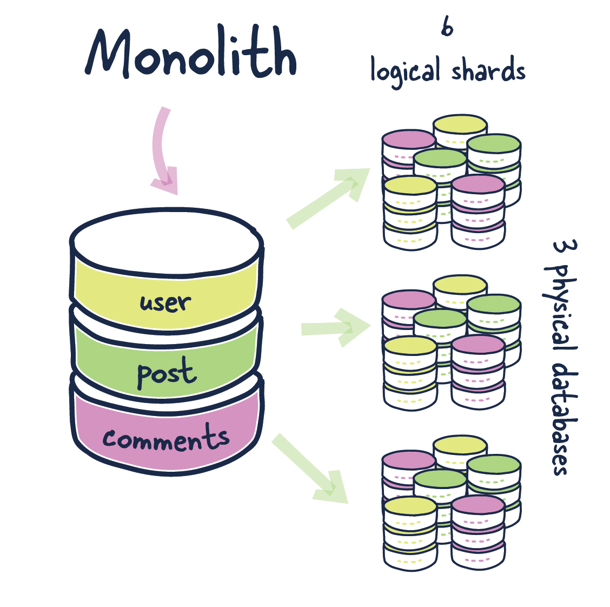
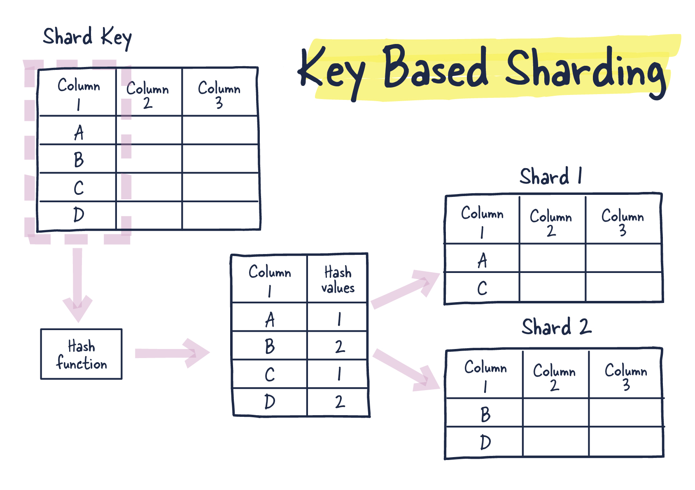
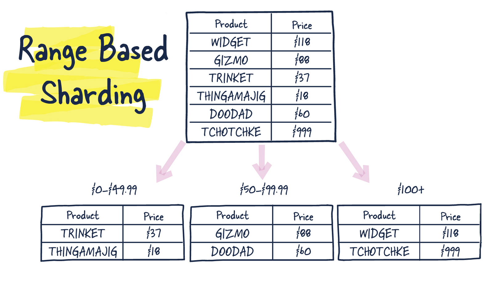
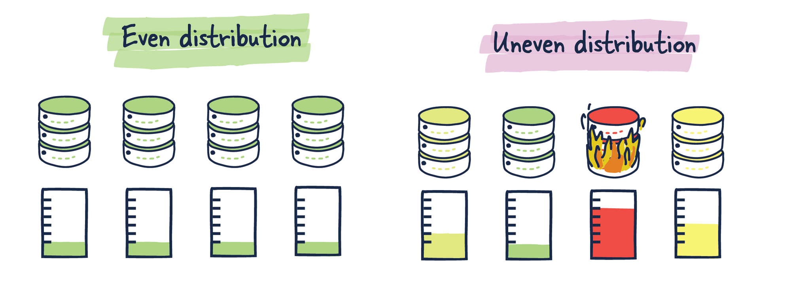

Ежедневно в ваше приложение добавляется новый функционал, появляются новые пользователи, количество данных растет.
Ваша база данных начинает замедляет работу вашего приложения. Многие не понимают как работает Database Sharding или сегментирование базы данных.
В этой статье я расскажу о сегментировании базы данных, его преимуществах, в том числе о том, когда его использовать, а когда нет.

Ваше приложение становится все лучше и лучше, каждый день появляются новые активные пользователи, вы храните все больше данных.
Из-за возросшей нагрузки база данных начинает замедлять работу вашего приложения.

Database Sharding может быть решением ваших проблем, но многие люди не знают, что это такое и, самое главное, когда его использовать.
В этой статье мы поговорим о том, что такое сегментирование базы данных, как оно работает и как его лучше всего использовать.

Прежде чем мы перейдем к этому вопросу, важно понять, почему мы разделяем хранилища данных и какие у вас есть различные варианты,
прежде чем вы приступите к сегментированию.

Когда таблицы достигают определенного размера, люди часто считают, что сегментирование — это волшебное решение всех проблем. 
Однако у меня были таблицы с миллиардами строк, и я не видел веских причин для сегментирования, поскольку мой шаблон использования хорошо подходил для одной таблицы и не видел никаких веских причин чтобы cегментировать таблицу таблицу.

## Что такое шардинг базы данных?

Проще говоря, шардинг — это метод распределения данных между несколькими машинами. Разделение становится особенно удобным, когда ни одна машина не может справиться с ожидаемой рабочей нагрузкой.

Разделение — это пример горизонтального масштабирования, тогда как вертикальное масштабирование — это пример того, как все больше и больше машин становится для поддержки новой рабочей нагрузки.

Теперь, когда мы обсудили возможные серверные архитектуры, давайте поговорим о размещении данных.
Вы можете секционировать данные несколькими способами и перемещать определенные таблицы в разные узлы,
что очень похоже на то, что вы видите в микросервисных архитектурах, где определенная часть вашего приложения имеет свой сервер базы данных. 
Приложение знает, где искать определенную часть вашего миросервиса. В качестве альтернативы вы можете хранить строки одной и той же таблицы в нескольких узлах базы данных, что приводит к таким идеям, как сегментирование ключей.

Более современные базы данных, такие как Cassandra и другие, абстрагируются от логики приложения и поддерживаются на уровне базы данных.

## Какие есть варианты перед шардингом?

Как и любая распределенная архитектура, сегментирование базы данных стоит денег. Настройка сегментов, поддержание данных в каждом сегменте в актуальном состоянии и проверка того, что запросы отправляются в нужные сегменты, — трудоемкий и сложный процесс. Прежде чем приступить к сегментированию, вы можете проверить, подойдет ли вам один из этих вариантов.

### Вариант 1: ничего не делать.

Сколько раз меня спрашивали, является ли сегментирование хорошей идеей без каких-либо явных узких мест или ограничивающих факторов, таких как нехватка оборудования, которое может поддерживать рабочую нагрузку.Если это работает, не трогай это.

### Вариант 2: Вертикальное масштабирование

Инжинеры избегали вертикального масштабирования до того, как ресурсы стали дешевле.
Вертикальное масштабирование не требует перепроектирования архитектуры приложений и баз данных.
Другие возможные ограничения с которыми можно столкнуться, такие как пропускная способность (сетевая или внутренняя по отношению к системе),
могут заставить вас использовать сегментирование.

### Вариант 3: Репликация

Если большая часть того, что вы делаете с данными, заключается в их чтении, репликация может сделать их более доступными и ускорить их чтение. Это может помочь вам избежать некоторых сложностей сегментирования базы данных. Производительность чтения можно повысить, сделав больше копий базы данных. Предполагая, что вы уже добавили кэш. Это можно сделать с помощью балансировки нагрузки или путем маршрутизации запросов. Но репликация усложняет обработку рабочих нагрузок с большим количеством операций записи, поскольку каждая запись должна быть скопирована на каждый узел. Это может варьироваться в зависимости от хранилища данных, некоторые из них делают это асинхронно, в то время как другие могут откладывать первоначальную запись, чтобы обеспечить ее репликацию.

WAL

 
WAL (журнал упреждающей записи) — это дополнительная структура на диске, которую можно только добавлять. Прежде чем изменения будут записаны в базу данных, они сначала записываются в журнал, этот журнал должен находиться в долговременном хранилище. Он используется для восстановления после сбоев и потерянных транзакций. Этот журнал также используется для поддержки репликации в некоторых базах данных, таких как PostgreSQL и MySQL.

### Вариант 4: Специализированные базы данных

Низкая производительность вызвана тем, что база данных должна быть лучше спроектирована для рабочей нагрузки, с которой она работает. Например, хранение данных поиска(речь о полнотекстовом поиске либо поиске по логам) в реляционном хранилище данных не имеет смысла. Перенос чего-то подобного в Elasticsearch более эффективен. Перемещение BLOB-объектов в хранилище объектов, такое как S3, может быть значительным преимуществом по сравнению с хранением их в реляционном хранилище. Возможно, имеет больше смысла отдать эту функцию на аутсорсинг, чем пытаться раздробить всю базу данных.

Сегментированная база данных может быть лучшим вариантом, если ваша база данных приложения управляет большим количеством данных, требует большого количества операций чтения и записи и/или должна быть доступна в любое время. Давайте посмотрим на плюсы и минусы шардинга.

## Когда нужен шардинг?

Разделение может дать вам почти неограниченную масштабируемость с точки зрения увеличения пропускной способности системы, емкости хранилища и доступности. С множеством небольших, более простых в управлении систем, каждая из которых может самостоятельно масштабироваться вверх и вниз со своими соответствующими репликами.

Все эти преимущества компенсируются эксплуатационной сложностью, накладными расходами приложений и стоимостью инфраструктуры для поддержки этого нового дизайна.

## Как это работает?

Прежде чем мы сможем разделить базу данных, нам нужно ответить на несколько важных вопросов. Ваш план будет зависеть от того, как вы ответите на эти вопросы.

- Как мы распределяем данные по шардам?
- Существуют ли потенциальные точки доступа, если данные распределены неравномерно?
- Какие запросы мы выполняем и как взаимодействуют таблицы?
- Как будут расти данные? Как их можно будет перераспределить?

Прежде чем мы пойдем дальше, важно понять следующую терминологию.

Shard Key — это часть первичного ключа, которая сообщает, как следует распределять данные. С помощью Shard Key вы можете быстро находить и изменять данные.

В одном узле находятся записи с одинаковым Shard Key. Группа данных с одним и тем же Shard Key называется Logical Shard. Несколько Logical Shard включены в узел базы данных, также известный как physical shard.

Логический сегмент может охватывать только один узел, потому что это атомарная единица хранения. Кластеру базы данных фактически не хватает места в случае, когда сегмент слишком велик для одного узла.

## Key Based Sharding

Алгоритмически сегментированные базы данных используют хеш-функцию для поиска данных. Это позволяет нам, учитывая конкретный ключ сегмента, найти правильный физический сегмент для запроса данных.

Данные распределяются только хэш-функцией. Он не принимает во внимание размер полезной нагрузки или использование пространства. Преимущества хеширования обеспечивают более равномерное распределение, когда подходящий ключ раздела недоступен, а местоположение можно вычислить на лету, если у вас есть правильный ключ раздела.

## Range Based Sharding

Данные разбиваются на чанки в зависимости от диапазонов определенного значения при шардинге на основе диапазонов.

Для этого требуется справочная таблица, чтобы увидеть, где должны храниться данные. Поддержание согласованности такой таблицы и, очевидно, выбор диапазонов здесь имеют решающее значение.

При выборе ключа сегмента для этого типа сегментирования важно выбрать ключ с высокой кардинальностью, поэтому количество возможных значений для этого ключа велико. Например, ключ с возможными значениями «Север», «Юг», «Восток» и «Запад» имеет низкую кардинальностью, поскольку их всего 4. В сочетании с этим в идеале вы бы предпочли хорошее распределение в пределах этой кардинальности.

Равномерное и неравномерное распределение данных.
Если вы знаете, что ваши данные распределяются одинаково по всем шардам, то все хорошо, но если вы выбрали неправильный диапозон, то одна из баз будет перегружена.

## Разделение на основе отношений

Этот механизм совместного использования хранит связанные данные вместе на одном физическом сегменте. Например, связанные данные часто распределяются по нескольким таблицам в реляционной базе данных.

Например, пользователь и все связанные с ним данные будут разделены на один и тот же физический узел для приложения, такого как Instagram, который будет включать сообщения и комментарии соответственно. Вы можете получить больше от одного раздела, поместив связанные объекты в один и тот же раздел. В результате обеспечивается более высокая согласованность во всем физическом сегменте и меньше запросов между физическими сегментами.

## Межсегментные транзакции (Cross Shard Transactions)

Наконец, я хочу рассказать о некоторых сложностях, которые могут возникнуть, когда вам нужно выполнять транзакции, охватывающие несколько сегментов. Независимо от того, сколько вы планируете, служба или приложение, которые живут достаточно долго, в конечном итоге столкнутся с несколькими межсегментными транзакциями.

По сути, это означает, что вам нужны гарантии транзакций, предоставляемые базой данных, совместимой с ACID, но между сегментами, где база данных не обеспечивает такого соответствия, поскольку данные, с которыми вы работаете, находятся вне области транзакции, которая ее инициировала.

Обычно это называется глобальной транзакцией, когда несколько подтранзакций должны координироваться и выполняться успешно. Как правило, чем дольше открыта транзакция, тем больше конфликтов и потенциальных сбоев может произойти.

## Двухэтапная фиксация (Two-phase commit)

Двухфазная фиксация проста в теории, но сложна в реализации на практике.

- Лидер записывает долговременную запись транзакции, указывающую на межсегментную транзакцию.

- Участники записывают постоянную запись о своей готовности совершить коммит и уведомляют лидера.

- Лидер фиксирует транзакцию, обновляя запись устойчивой транзакции после получения всех ответов. (Он может прервать транзакцию, если никто не отвечает.)

- Участники могут показать новое состояние после того, как лидер объявит решение о коммите. (Они удаляют промежуточное состояние, если лидер прерывает транзакцию.)

Серьезной проблемой является усиление чтения и записи в пути протокола. Усиление записи происходит потому, что вы должны написать запись транзакции и создать устойчивую фиксацию, для чего требуется как минимум одна запись на каждого участника. Конкуренция за блокировку и нестабильность приложения могут быть результатом чрезмерного количества операций записи. База данных должна дополнительно фильтровать каждое чтение, чтобы гарантировать, что она не увидит никакого состояния, зависящего от ожидающей транзакции между шардами, которая влияет на все чтения в системе, даже нетранзакционные.

## Заключение

Мы обсудили сегментирование, когда его использовать и как его настроить. Шардирование — отличное решение для приложений, которым необходимо управлять большими объемами данных и иметь их легкодоступными для большого количества операций чтения и записи. Тем не менее, это усложняет работу. Прежде чем приступить к внедрению, следует подумать о том, стоят ли выгоды затрат или есть более простое решение.

[Оригинальная статья](https://architecturenotes.co/database-sharding-explained/)