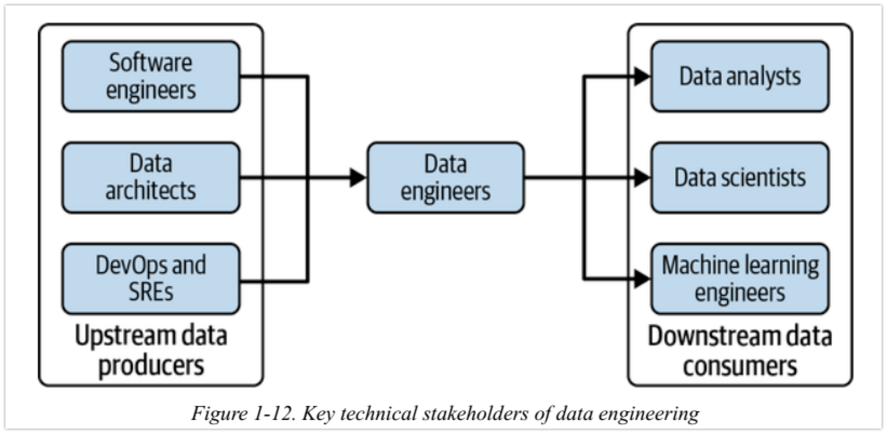

На практике жизненный цикл обработки данных охватывает множество областей ответственности. Инженеры данных находятся на стыке различных ролей, напрямую или через менеджеров, взаимодействуя со многими организационными подразделениями.

Инженер данных является связующим звеном между "*производителями данных*", такими как software engineers, data architects и DevOps или инженеры по надежности (SRE), и "*потребителями данных*", такими как data analysts, data scientists, и ML инжинеры. Кроме того, инженеры данных будут взаимодействовать с теми, кто выполняет операционные функции, например, с инженерами DevOps.

Чтобы добиться успеха в качестве инженера данных, вам необходимо понимать архитектуру данных, которую вы используете или проектируете, а также исходные системы, производящие данные, которые вам понадобятся.

## Upstream stakeholders

### Data architects

Архитекторы данных работают на уровне абстракции, на один шаг дальше от инженеров данных. Они разрабатывают план управления организационными данными, отображая процессы и общую архитектуру данных и системы. Они также служат мостом между технической и нетехнической сторонами организации. Успешные архитекторы данных, как правило, имеют «боевые шрамы» от обширного инженерного опыта, что позволяет им направлять и помогать инженерам, успешно сообщая о технических проблемах нетехническим заинтересованным сторонам бизнеса.

### Software engineers

Создают программное обеспечение и системы, которые управляют бизнесом; они в значительной степени отвечают за создание внутренних данных, которые инженеры данных будут использовать и обрабатывать. Системы, созданные разработчиками программного обеспечения, обычно генерируют данные о событиях приложений и журналы, которые сами по себе являются важными активами.  В хорошо управляемых технических организациях Software engineers и Data Engineer координируют свои действия с самого начала нового проекта, чтобы разработать данные приложения для использования аналитическими приложениями и приложениями машинного обучения.

### DevOps engineers and site-reliability engineers

DevOps и SRE часто производят данные посредством оперативного мониторинга. Мы классифицируем их как вышестоящих по отношению к инженерам данных, но они также могут быть нижестоящими, потребляя данные через информационные панели или взаимодействуя с инженерами данных напрямую при координации операций систем данных.

## Downstream stakeholders

Современная профессия инженера данных существует для обслуживания нижестоящих потребителей данных. В этом разделе мы посмотрим, как инженеры данных взаимодействуют с различными нижестоящими ролями.

### Data scientists

строят перспективные модели, чтобы делать прогнозы и рекомендации. Затем эти модели оцениваются на реальных данных, чтобы обеспечить ценность различными способами. Например, оценка модели может определять автоматические действия в ответ на условия в реальном времени, рекомендовать продукты клиентам на основе истории просмотров в их текущем сеансе или делать экономические прогнозы в реальном времени, используемые трейдерами.

### Data analyst

Аналитики данных (или бизнес-аналитики) стремятся понять эффективность и тенденции бизнеса. В то время как Data scientists смотрят в будущее, аналитик данных обычно фокусируется на прошлом или настоящем. Аналитики данных обычно выполняют SQL-запросы в хранилище данных или озере данных. Они используют различные инструменты бизнес-аналитики, такие как Microsoft Power BI, Looker или Tableau. Аналитики данных являются экспертами в области данных, с которыми они часто работают, и хорошо знакомы с определениями данных, характеристиками и проблемами качества. Типичными последующими клиентами аналитика данных являются бизнес-пользователи, руководство и руководители.

### Machine learning engineers and AI researchers

Инженеры по машинному обучению (инженеры ML) пересекаются с Data engineer и Data scientists. ML инжинеры  разрабатывают передовые методы машинного обучения, обучают модели, а также проектируют и поддерживают инфраструктуру, в которой выполняются процессы машинного обучения в масштабируемой производственной среде. Инженеры машинного обучения часто обладают передовыми практическими знаниями в области машинного обучения и методов глубокого обучения, а также таких сред, как PyTorch или TensorFlow. В то время как несколько лет назад внимание машинного обучения было сосредоточено на том, как создавать модели, проектирование машинного обучения теперь все больше внимания уделяет включению передового опыта операций машинного обучения (MLops) и других практик, ранее принятых в разработке программного обеспечения и DevOps.

AI researchers - работают над новыми передовыми методами машинного обучения. AI researchers могут работать в крупных технологических компаниях, специализированных стартапах в области интеллектуальной собственности (OpenAI, DeepMind) или академических учреждениях.

## Data Engineers and Business Leadership

Мы обсудили технические роли, с которыми взаимодействует дата-инженер. Но инженеры данных также действуют в более широком смысле, часто в нетехнических качествах. Компании стали все больше полагаться на данные как на ключевую часть многих продуктов или как на продукт сам по себе. Инженеры данных теперь участвуют в стратегическом планировании и возглавляют ключевые инициативы, выходящие за рамки ИТ. Инженеры данных часто поддерживают архитекторов данных, выступая связующим звеном между бизнесом и наукой о данных/аналитикой.

Руководители C-level все больше занимаются данными и аналитикой, поскольку они признаны важными активами для современного бизнеса. Руководители теперь занимаются инициативами, которые когда-то были исключительно прерогативой ИТ, такими как миграция в облако или развертывание новой платформы данных о клиентах.

### Chief executive officer

Главные исполнительные директора (СЕО) нетехнологических компаний обычно не интересуются мельчайшими подробностями фреймворков данных и программного обеспечения. Вместо этого они определяют видение в сотрудничестве с техническими ролями C-suite и руководителями данных компании. Инженеры данных открывают окно в то, что возможно делать с данными.

### Chief information officer

Директор по информационным технологиям (CIO) — это старший руководитель высшего звена, отвечающий за информационные технологии в организации; это внутренняя роль. ИТ-директор должен обладать глубокими познаниями в области информационных технологий и бизнес-процессов — одного этого недостаточно. ИТ-директора руководят организацией информационных технологий, устанавливая текущие политики, а также определяя и реализуя важные инициативы под руководством генерального директора.

### Chief technology officer

Главный технический директор (CTO) похож на CIO. Технический директор владеет ключевой технологической стратегией и архитектурой для внешних приложений, таких как мобильные, веб-приложения и IoT — все критически важные источники данных для инженеров данных.Технический директор, скорее всего является опытным разработчиком и хорошо разбирается в основах разработки программного обеспечения и системной архитектуре.

### Chief data officer

В 2002 году в Capital One была создана должность директора по данным (CDO), чтобы признать растущую важность данных как бизнес-актива. CDO отвечает за активы данных и стратегию компании. CDO сосредоточены на полезности данных для бизнеса, но должны иметь сильную техническую базу. CDO контролируют информационные продукты, стратегию, инициативы и основные функции, такие как управление мастер-данными и конфиденциальность.

### Chief analytics officer

Директор по аналитике (CAO) — это вариант роли CDO. Там, где существуют обе роли, CDO фокусируется на технологии и организации, необходимых для предоставления данных. CAO отвечает за аналитику, стратегию и принятие решений для бизнеса. CAO может контролировать Data Science и ML, хотя это во многом зависит от того, есть ли в компании роль CDO или CTO.

### Chief algorithms officer

Директор по алгоритмам (CAO-2) — это недавнее нововведение в высшем руководстве, высокотехнологичная должность, ориентированная конкретно на Data Science и ML. CAO-2 обычно имеют опыт работы в качестве отдельных участников и руководителей групп в проектах по Data Science и ML. Часто они имеют опыт исследований в области машинного обучения и соответствующую ученую степень.
