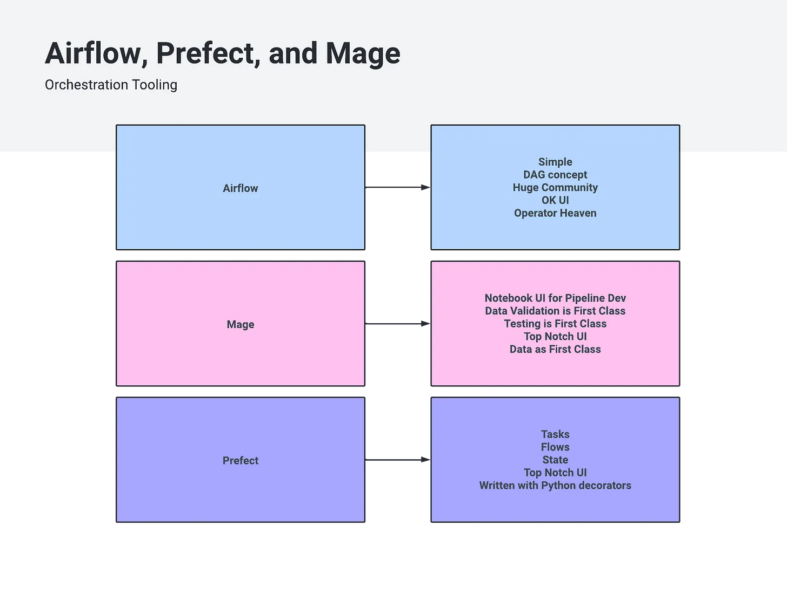
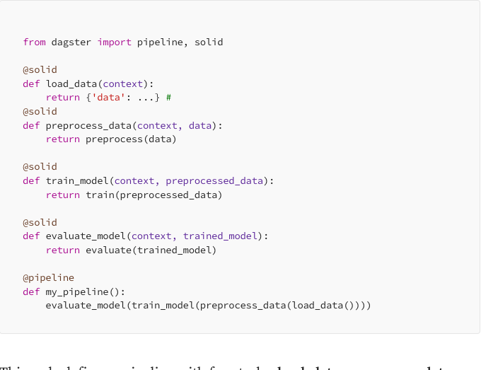
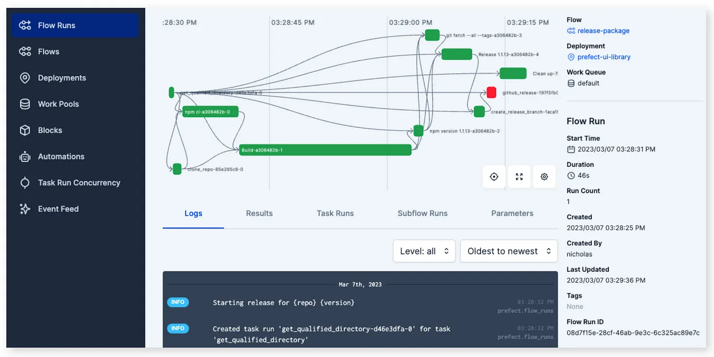
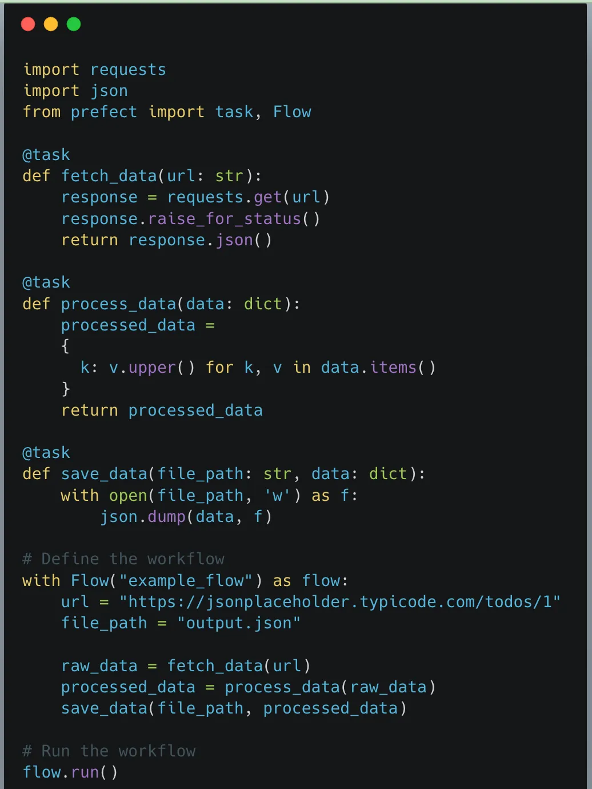
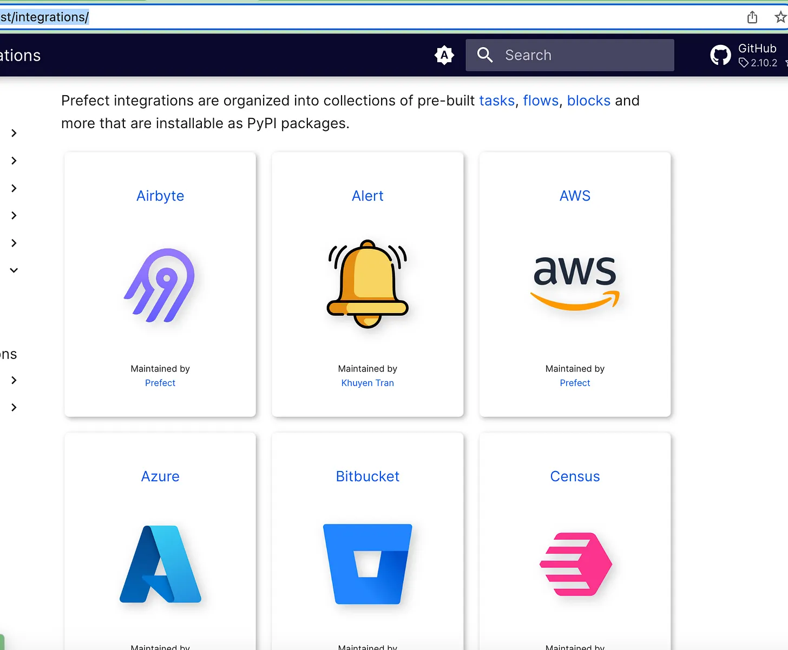
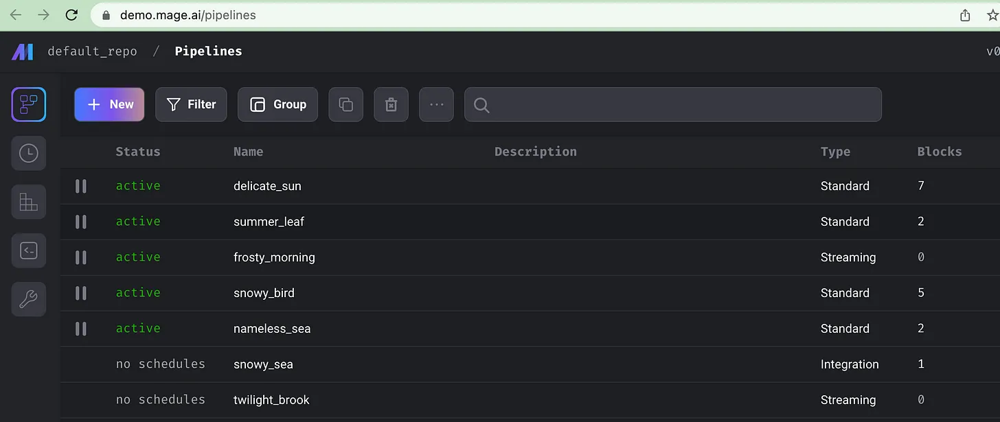
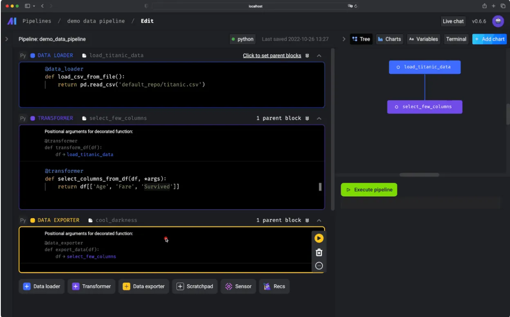
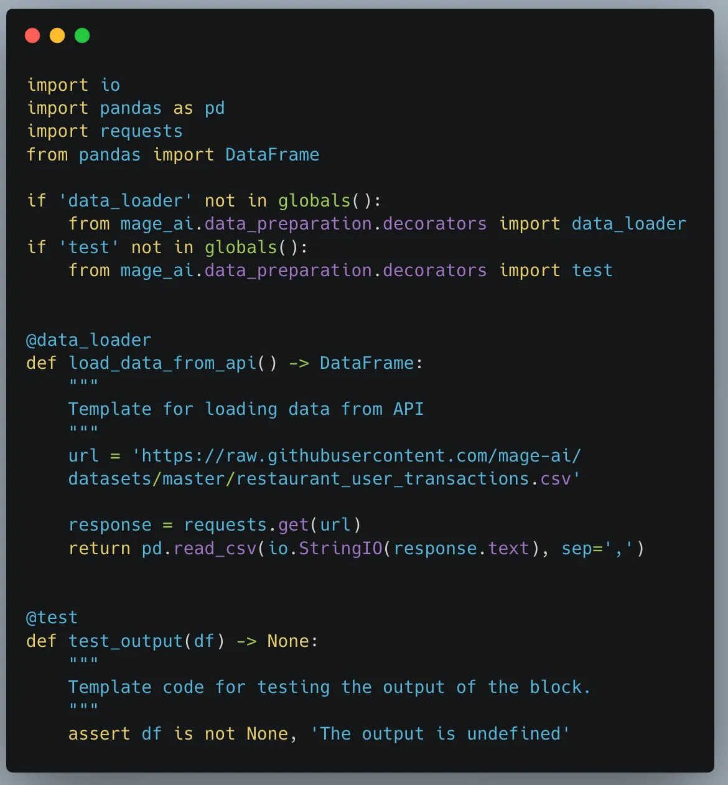

Что ж, несмотря на то, что это будет правда о Airflow, Prefect, Dagster и Mage, мне интересно, останется ли в 2023 году хоть какая-то правда.
Мир данных меняется, и темпы выпуска новых инструментов ошеломляют. Каждую неделю появляется новая библиотека, такая как Polars, или очередная популярная SQL-фишка, такая как DuckDB. Иногда бывает сложно отличить факты от вымысла, а маркетинговую группу от реальности.

А как насчет, пожалуй, одной из самых важных частей стека данных? Инструменты оркестрации и управления зависимостями?

Давайте заглянем вперед, в облачное и мрачное будущее. Действительно ли это конец эпохи Apache Airflow? Dagster здесь, Prefect здесь, Databricks Workflows, все пытаются сбросить Airflow с его высокого трона.

> Airflow уже давно доминирует в области оркестрации данных, и это кажется вечностью. Когда AWS приняла его как MWAA(Amazon Managed Workflows for Apache Airflow), а GCP — как Composer, казалось, что флаг прочно водрузился на вершине. Airflow укрепилися и обрушивают свое оружие на любого , кто осмелится подняться на тот же холм в поисках славы.

## Наступила новая эпоха инструментов оркестрации.

В современном быстро меняющемся мире, данные стали одним из наиболее ценных активов. В условиях постоянно растущего объема и сложности данных, стало необходимо иметь эффективные инструменты оркестрации данных, которые могут управлять рабочими процессами. Четыре популярных инструмента оркестрации данных — это Prefect, Mage, Dagster и Airflow. В этой статье мы сравним эти инструменты верхнеуровнево, изучим концепции и поможем выбрать тот, который подходит для вашего стека данных.

Честно говоря, меня не волнует, насколько хороши пользовательские интерфейсы, я уверен, что и у Prefect, и у Mage они лучше, чем у Airflow. Это нормально. Вероятно, у нас должны быть другие причины для выбора инструмента.

> В чем истинная разница между Airflow, Prefect, Dagster и Mage? Это их подход к data flows? Есть ли интеграции? Что именно отличает их и имеет ли это значение?

Вот на что я хочу сегодня ответить. Меня не волнует производительность, я хочу понять, как эти инструменты спроектированы, как они используются и как они влияют на инженеров данных при написании конвейеров данных и управлении ими.

- В чем разница между Airflow, Prefect, Dagster и Mage?
- Как эти инструменты подходят к data pipelines и оркестрации?
- Как эти инструменты влияют на то, как инженеры данных решают проблемы?

Итак, я собираюсь объединить все эти инструменты в группу «data orchestration and pipeline management». Меня не волнует маркетинговая шумиха, это то, для чего их используют. Кроме того, я не эксперт, я обычный инженер, пытающийся делать обычные вещи.

Во-первых, давайте рассмотрим то, что я бы назвал «основными концепциями» каждого инструмента.
Затем попутно выясните, какой инструмент лучше.

## Dagster

Apache Airflow и Dagster имеют схожие цели и функции, но подходят к этим целям немного по-разному. Вот разбивка некоторых ключевых особенностей Dagster:

- Составные определения пайплайна с проверкой типа
- Автоматическое отслеживание зависимостей между задачами
- Встроенная проверка данных и обработка ошибок. 
- Интеграция с платформами машинного обучения, такими как TensorFlow и PyTorch.
- Особое внимание к тестированию и воспроизводимости

Давайте подробнее рассмотрим примеры кода 

Этот код определяет пайплайн с четырьмя задачами: load_data, preprocess_data, train_model и Assessment_model. Каждая задача определяется как сплошная функция, а конвейер определяется с помощью декоратора @pipeline. Обратите внимание, что задача train_model принимает в качестве входных данных выходные данные задачи preprocess_data, а задача Assessment_model принимает в качестве входных данных выходные данные задачи train_model. Dagster автоматически отслеживает эти зависимости и гарантирует, что задачи выполняются в правильном порядке.

Так как же эти две платформы сравниваются с точки зрения производительности и функций? Вот некоторые вещи, которые следует учитывать:

- **Task-based vs. pipeline-based**: Apache Airflow основан на задачах, что означает, что вы определяете каждую отдельную задачу и ее зависимости отдельно. Dagster основан на конвейере, что означает, что вы определяете весь конвейер как единое целое с вложенными в него задачами. Это может облегчить управление зависимостями в сложных конвейерах.
- **Динамическое создание задач**: Apache Airflow позволяет динамически генерировать задачи на основе данных или других факторов. В Dagster нет этой функции, что может быть ограничением в некоторых случаях использования.
- **Обработка и проверка ошибок**: Dagster имеет встроенную поддержку проверки данных и обработки ошибок, что может быть очень полезно в рабочих процессах с интенсивным использованием данных. Apache Airflow не имеет этой функции, хотя имеет механизмы обработки ошибок для отдельных задач.
- **Интеграция с фреймворками ML**: Dagster имеет встроенную интеграцию с фреймворками ML, такими как TensorFlow и PyTorch. Apache Airflow не имеет этой функции, хотя имеет интеграцию с другими инструментами, такими как Spark и Hadoop.

В целом, обе платформы имеют свои сильные и слабые стороны. Apache Airflow — более зрелая платформа с более обширным сообществом и экосистемой, а Dagster обладает некоторыми инновационными функциями, которые делают ее хорошим выбором для рабочих процессов с интенсивным использованием данных.

В заключение, выбор между Apache Airflow и Dagster зависит от вашего конкретного варианта использования и потребностей. Если вам нужна более зрелая платформа с большим сообществом и экосистемой, Apache Airflow может быть лучшим выбором. Если вам нужна надежная проверка данных и обработка ошибок или интеграция с платформами машинного обучения, Dagster может быть лучшим выбором.

## Prefect

Основные концепции Prefect вращаются вокруг построения, управления и мониторинга рабочих процессов с данными. Эти концепции имеют основополагающее значение для понимания и эффективной работы с Prefect.

### Prefect core concepts:

Если зайти на сайт Префекта и начать читать… ничего необычного вы не увидите. В нем говорится о рабочих процессах «Создание», «Выполнение» и «Мониторинг». На сайте Prefect есть цитата, которая очень хорошо характеризует Prefect и, по сути, является тем выводом, к которому я пришел.

> «Prefect позволяет вам создавать и наблюдать за устойчивыми рабочими процессами обработки данных, чтобы вы могли понимать, реагировать на неожиданные изменения и восстанавливаться после них. Это самый простой способ превратить любую функцию Python в unit of work, которую можно наблюдать и оркестровать. Просто принесите свой код Python, добавьте несколько декораторов и вперед!»

Что я нашел в этой цитате, так это то, что я не нашел ничего принципиально отличающегося в Prefect, скажем, от Airflow. В этом нет ничего потрясающего или особенного. Это просто попытка быть Airflow, только немного лучше.

Меня это не воодушевило. Мне нужна веская причина покинуть огромное сообщество Airflow.

Давайте поговорим об основных концепциях Prefect. Как они подходят к проблемам инженерии данных?

1. **Tasks**: Tasks являются основными строительными блоками Prefect. Они представляют собой отдельные единицы работы или операций, такие как получение данных из API, преобразование данных или обучение модели машинного обучения. Задачи можно создавать с использованием класса Task, а пользовательские задачи можно определять путем их подклассов.

2. **Flows**. Flows — это наборы задач, которые имеют определенный порядок выполнения. Они представляют собой полный рабочий процесс или конвейер данных. В Prefect вы создаете потоки, связывая задачи вместе и определяя их зависимости и порядок выполнения. Потоки создаются с использованием класса Flow.

3. **State**. State представляет собой состояние задачи или потоков в определенный момент времени. Prefect использует состояние для отслеживания хода выполнения задач и потоков во время выполнения. Общие состояния включают Pending, Running, Success, Failed и многие другие. Объекты состояния являются экземплярами класса State или его подклассов.

4. **Results**. Results представляют собой данные, возвращаемые потоком или задачей, определенной выше.

5. **Task runners**: Task runners облегчают использование конкретных исполнителей для задач Prefect, позволяя выполнять задачи одновременно, параллельно или распределять их по нескольким ресурсам. Task runners не являются обязательными для выполнения задач. Когда вы вызываете функцию задачи напрямую, она работает как стандартная функция Python без использования средства запуска задач.

Конечно, Prefect предлагает облачную версию своего инструмента. Помните, что сказал Prefect о написании Python и последующем добавлении декоратора? Это по сути… Prefect. Посмотрите на этот простой пример.

Что мы можем предположить о Prefect на основании увиденного? Это необычный и приятный графический интерфейс, ориентированный на то, чтобы превратить Python в инструмент, используемый для написания конвейеров данных. Но что, если вы хотите запустить Databricks или Snowflake? Конечно, он может это сделать. Например 

``
from prefect.tasks.databricks.databricks_submitjob import (
DatabricksRunNow,
DatabricksSubmitRun,
)
``

Напоминает что-нибудь? Так и должно быть, это во многом точная копия Airflow. На их сайте есть большой список «Интеграций», хотя он не такой большой, как я мог подумать, а некоторые кажутся бессмысленными… например, Твиттер.

### Чем Prefect отличается от Airflow?

Вы, как и я, можете спросить себя, почему кто-то решил использовать Prefect вместо Airflow с его обширным сообществом.

Я прочесал сайт взад и вперед и документацию. Просто много разговоров о создании высокопроизводительных конвейеров данных, но на самом деле за этими словами нет ничего «солидного». Я не могу указать на функцию x или y или концепцию дизайна и сказать: «Это то, что отличает Prefect от Airflow или делает его лучше».

Prefect предлагает некоторые интересные функции, такие как проекты и развертывания, лучший способ организовать, развернуть и запустить ваши конвейеры. Это достаточно?

Лично я не вижу, как Prefect превосходит Airflow в какой либо категории. Конечно, пользовательский интерфейс лучше и имеет больше функций, хотя чем сложнее что-то становится, тем сложнее его использовать и тем сложнее становится кривая обучения. Может быть, лучше работать в масштабе? Опять же, мне недостаточно просто хотеть вкладывать в это время или ресурсы.

> Мне кажется, что зависимость от простого использования собственного Python для определения задач и рабочих процессов вместе с декораторами на самом деле вредит. Он тесно связывает оркестрацию конвейера данных с реальным кодом, который вы пишете для преобразования наборов данных. Поскольку данные слишком велики для их обработки на «воркере» Airflow или на Prefect, мир движется к коннекторам для таких инструментов, как Snowflake, Databricks и остальных. На самом деле нам не нужны инструменты оркестрации, которые ВЫПОЛНЯЮТ обработку данных.

Я считаю, что это единственное и главное различие между Prefect и Airflow. Prefect отказывается от абстракции DAG и использует Python и декораторы для выполнения своей работы.

Думаете, я слишком суров к Prefect? Возможно, но как пользователь Airflow я не вижу веской причины, по которой я бы перешел на Prefect. В нем нет каких-либо потрясающих функций или прорывов, которые заставили бы меня захотеть переключиться на него. Если бы я начинал с чистого листа, выбрал бы я его? Возможно нет. Я хочу что-то, за чем стоит большое сообщество.

Любой инженер данных знает, что какое-то время инструмент работает хорошо, но когда это не так, вам нужно куда-то обратиться.

## Mage

**Mage** — это инструмент оркестрации данных, разработанный для современной инфраструктуры данных. Он предоставляет простой интерфейс для построения сложных рабочих процессов, а также обладает высокой масштабируемостью и отказоустойчивостью. Интерфейс Mage интуитивно понятен и позволяет легко создавать и контролировать рабочие процессы. Во всяком случае, так говорит маркетинг.

> «Инструмент конвейера данных с открытым исходным кодом для преобразования и интеграции данных. Современная замена Airflow». - mage.ai

Ну, я люблю честность. По крайней мере, они откровенно говорят о том, что пытаются сделать — заменить Airflow. Прежде чем сказать, что я любитель Airflow и никогда не найду ему замену, придержите коней. Airflow иногда сводит меня с ума, его серверная архитектура оставляет желать лучшего, может быть неуклюжей и часто вызывает рвоту до такой степени, что легче развернуть новую среду, чем исправить ее.

Mage имеет несколько уникальных функций, которые выделяют его среди других инструментов оркестрации данных. Например, он имеет встроенный каталог данных, который позволяет отслеживать происхождение ваших данных, а также мощный механизм повтора, который может автоматически повторять неудачные задачи. Кроме того, он предлагает пользовательский интерфейс Notebook для разработки, обеспечивающий быструю итерацию и обратную связь. Очень хорошо!!

Это функции, которые существенно отличаются от тех, к которым мы привыкли в Airflow. Это другой подход, и это главное.

Как Mage подходит к data pipelines?

### Mage Core Concepts.

1. Project and Pipeline. Проект похож на репозиторий GitHub. Pipeline содержит все блоки кода, которые вы хотите запустить, представленные файлом YAML.

2. Block: набор кода в файле, который может быть выполнен по желанию. Блоки могут иметь зависимости. Типы блоков, которые вы узнаете…
 - Transformer
 - Data Loader
 - Data Exporter
 - Sensor
 - Chart

3. Engineering Best Practices - это основная функция
 - Bock reusability.
 - Automatic Testing of Blocks.
 - Data Validation is pre-built into Blocks.
 - Data is core, Blocks produce Data.
 - Pipeline and Data Versioning, along with Backfilling.
 - Scalable via Spark.
 - Develop via Notebook UI.

Как же выглядит код Mage?

### Что же отличает Mage от других оркестраторов?

Сразу бросается в глаза одна вещь, которая отличает Mage как от Airflow, так и от Prefect. Хотя он похож на Prefect в том, как он использует простой Python и декораторы для определения основной части обработки, подход к передовым инженерным практикам — это то, где он сияет и полностью отличается от двух других.

> Вместо того, чтобы Mage был просто еще одним инструментом ETL и оркестрации с несколько иным подходом к Airflow (Prefect), Mage пытается фундаментально изменить способ разработки и использования конвейеров данных, сосредоточив внимание на аспектах разработки и проектирования, чтобы выделиться среди других.

Что мне бросается в глаза в Маге, если не вдаваться в подробности?

- Простая в использовании настройка Docker, которая облегчит жизнь при разработке.
- «Каждый шаг вашего конвейера представляет собой отдельный файл, содержащий модульный код, который можно использовать повторно и тестировать с помощью проверки данных»
- «Немедленно просматривайте результаты вывода вашего кода с помощью интерактивного notebook UI».
- «Разверните Mage в AWS, GCP или Azure с помощью всего двух команд, используя поддерживаемые шаблоны Terraform».

Честно говоря, если бы Mage был просто еще одним приятным пользовательским интерфейсом с иным подходом к разработке пайплайнов, чем Airflow… я бы отнесся к этому скептически. Но, похоже, они использовали принципиально иной подход, предоставив, не только лучший пользовательский интерфейс, ведение журналов и мониторинг… но фактически сосредоточившись на опыте разработчиков и продвигая лучшие инженерные практики таким образом, чтобы обеспечить очевидную ценность, чего нет у Airflow и Prefect.

## Apache Airflow.

Я не собираюсь уделять время Airflow. По этой теме создано множество видео и текстового контента. Вы сможете легко нагуглить это.
Airflow скучен и популярен.

## Сравнение

Прежде чем вы обвините меня в кумовстве, у меня нет никакого скина в игре Airflow, Prefect или Mage. Я никогда не использовал Prefect или Mage ни для чего, кроме как для изучения. Я использовал Airflow в автономном развертывании через Docker.

> По мере того, как я начал масштабировать работу с Airflow, я начал видеть слабые места в  Airflow, которые могут быть не для всех очевидны. Кроме того, опыт разработки, способ написания и развертывания кода с помощью Airflow не соответствуют лучшим практикам и оставляют желать лучшего.

По мере того, как я рос и продолжал свою карьеру в области разработки данных, я обнаружил, что некоторые инструменты…

- Масштабируемые.
- Подталкивают вас к лучшим инжинерным практикам.
- Надежные.
- Для их масштабного использования не требуется огромных усилий по управлению и глубокого понимания архитектуры системы.

Как человек, который любит и использует Airflow, я считаю, что он не попадает в этот список, да он работает, справляется с поставленными задачами. Следовательно, люди используют его.

> Конечно, мы могли бы установить каждый инструмент, построить пайплайн и запустить его. Но что это скажет на самом деле? Мы знаем, что каждый инструмент — Airflow, Prefect и Mage — способен создавать и запускать конвейеры, вероятно, для большинства ситуаций и обстоятельств.

Нам нужно задать себе более общий вопрос: «какой инструмент на высоком уровне делает что-то новое и лучшее, подходит к проблеме инженерии данных, оркестрации и управления конвейерами новым и уникальным способом, который обеспечит реальную выгоду, а не просто новый блестящий инструмент?»

Ответ очевиден: Mage.ai. Нет, мне не заплатили за то, чтобы я это сказал, и я говорю это как человек, который уже много лет является активным пользователем Airflow.

Я ничего не имею против Prefect, за исключением того, что он недостаточно отличается от Airflow. Может быть, это просто их плохой маркетинг, кто знает? Я мог упустить что-то важное.

#### Airflow еще долго будет оставаться на вершине, но его слабые места очевидны

Я всегда буду любить Airflow, это уникальный инструмент, его легко освоить и использовать. Но любой, кто использовал Airflow в больших масштабах и не имеет специальной команды для его поддержки (зачем она вам нужна?), знает, что вы можете легко выстрелить себе в ногу, и то, что когда-то было простым в использовании, становится неповоротливым.

Также неизбежно то, что появляются новички и начинают ковыряться в слабостях Airflow, внедряя лучшие практики и решая проблемы для пользователей Airflow.

- Интерфейс неуклюжий, даже в последних версиях.
- В масштабе Airflow требует серьезного управления и понимания, чтобы поддерживать его производительность.
- Нет best practice в разработки пайплайнов.

Конечно, существует множество вариантов использования Airflow в небольших масштабах, где он работает просто великолепно. Должны ли эти организации мигрировать? Вероятно, им это тоже не повредит, но, скорее всего, это не имеет особого смысла.

#### Откуда вы знаете, что вам следует переключиться с Airflow на Mage или Prefect?

Я собираюсь задать вам несколько вопросов о вашей культуре разработки данных и вариантах использования.

- Ваша setup Airflow начинает использовать более 50 DAG и продолжает расти?
- Ваши DAG и пайплайны перемещаются от простого к сложному?
- Включает ли ваша культура разработки данных лучшие практики?
  - Unit tests
  - CI/CD
  - Data Quality

Если вышеперечисленные пункты — это то, чего вы хотите достичь, и вы заботитесь о совершенстве в инженерной культуре, то я бы посоветовал вам попробовать такой инструмент, как Mage.ai, вместо Airflow, если у вас есть выбор.

В конце концов, запуск большого количества конвейеров, скорее всего, скажет вам спасибо. Почему? Потому что ваша кодовая база, вероятно, будет более понятной, более надежной и лучше соответствует лучшим практикам. Ваши развертывания, вероятно, будут лучше, качество ваших данных и тестирование будут лучше.

Развитие ваших инженеров, работающих над базой кода для поддержки и написания новых пайплайнов, станет гораздо более плавным и эффективным процессом. Если бы мне пришлось выбирать между этими инструментами для нового проекта, я бы выбрал Mage.