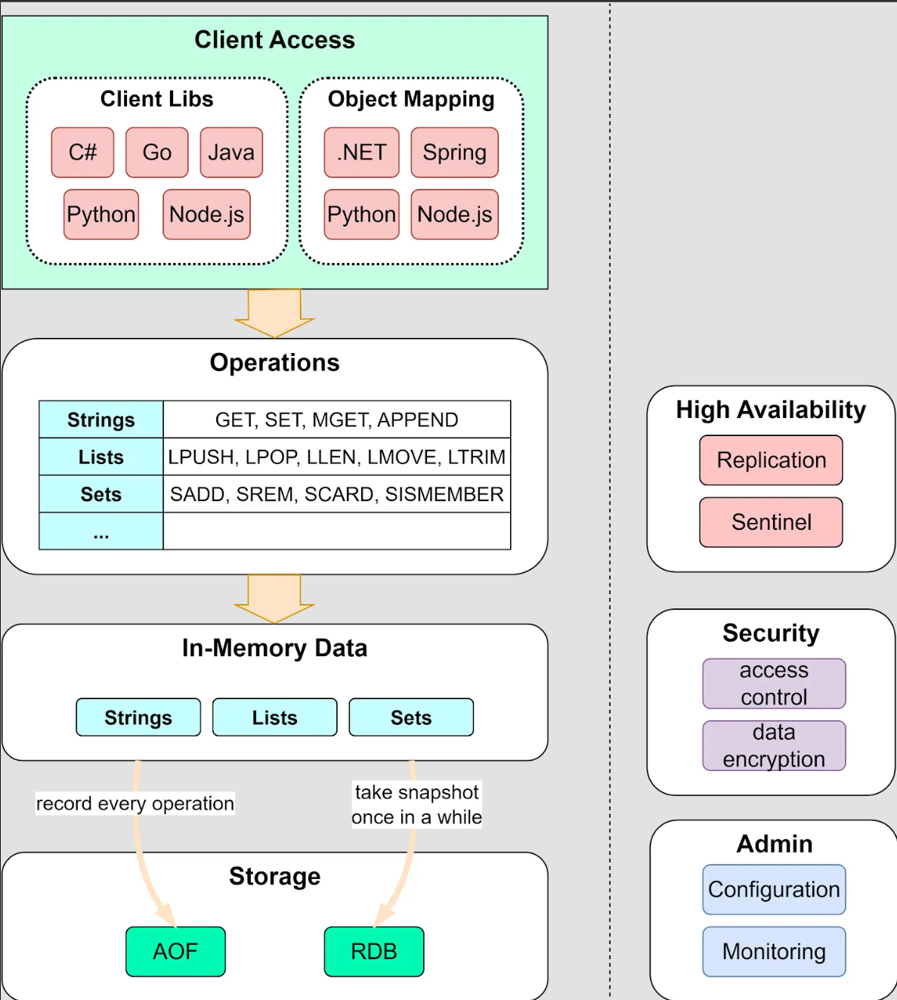
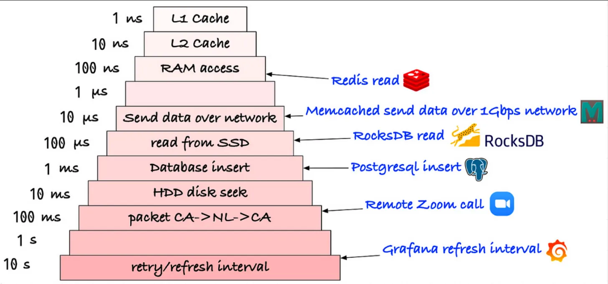
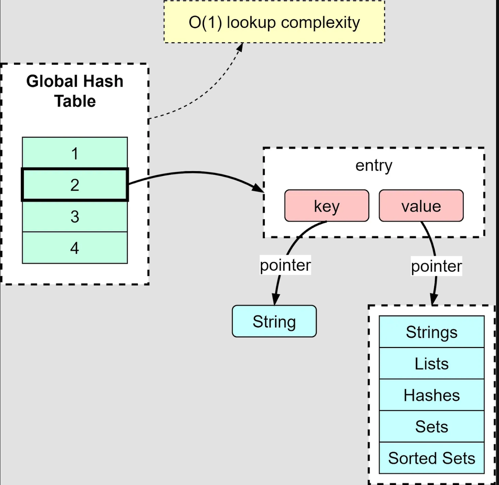
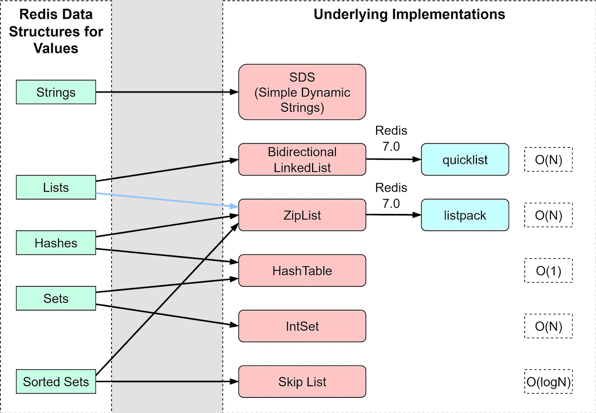
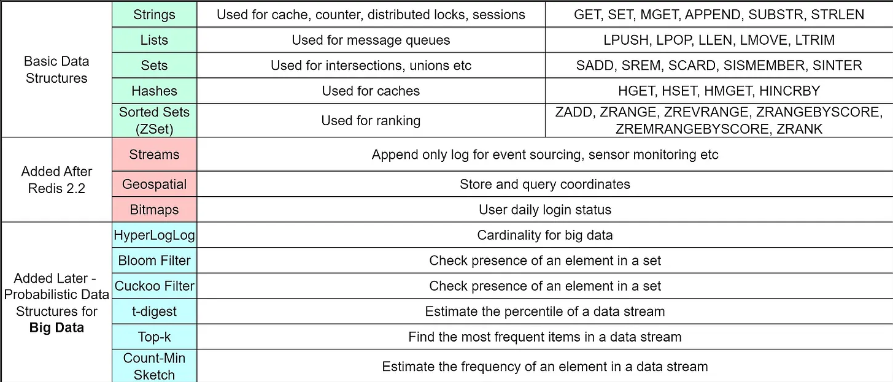
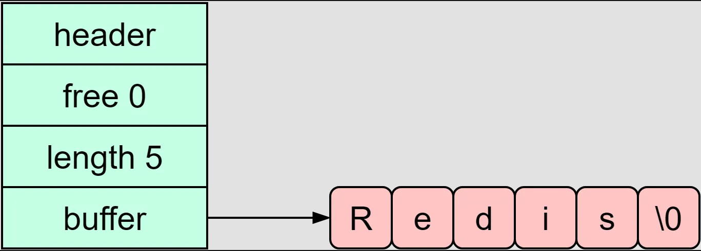
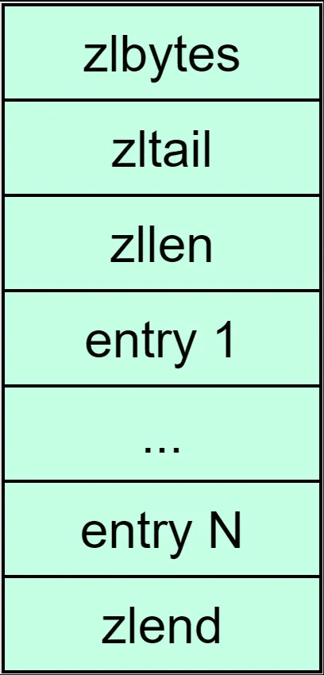

Redis (Remote Dictionary Server) — это in-memory база данных с открытым исходным кодом (лицензия BSD), часто используемая в качестве кэша, брокера сообщений или механизма потоковой передачи. Он имеет широкую поддержку структур данных, включая базовые структуры данных, такие как String, List, Set, Hash, SortedSet, а также вероятностные структуры данных, такие как Bloom Filter и HyperLogLog.

В этом посте мы обсудим, почему Redis быстро разрабатывает архитектуру.

## Redis Architecture

Redis - это in-memory key-value база данных, которая предоставляет несколько важных функций.

- Структуры данных, используемые для значений

- Операции, разрешенные над структурами данных

- Сохранение данных

- Высокая доступность

Ниже приведена высокоуровневая диаграмма архитектуры Redis. Давайте пройдемся по ней по порядку.

## Client Libraries

Существует два типа клиентов для доступа к Redis: один поддерживает подключения к базе данных Redis, а другой создан на основе первого и поддерживает сопоставление объектов.

Redis поддерживает широкий спектр языков, что позволяет использовать его в самых разных приложениях. Кроме того, клиентские библиотеки OM позволяют нам моделировать, индексировать и запрашивать документы.

## Data Operations

Redis имеет обширную поддержку типов данных, включая Strings, Lists, Sets, Hashes и т. д. В результате Redis подходит для широкого спектра сценариев. В зависимости от типов данных Redis поддерживает разные операции.

Основные операции аналогичны реляционной базе данных, поддерживающей CRUD.
(Create-Read-Update-Delete):

 - GET: Получить значение ключа
 - PUT: Создать новую пару ключ-значение или обновите существующий ключ.
 - DELETE: Удаление пары ключ-значение

Структуры данных и операции — важная причина, почему Redis настолько эффективен.

## In-Memory v.s. On-Disk

Redis хранит данные в памяти. Чтение и запись данных в памяти обычно происходит в 1000–10 000 раз быстрее, чем чтение/запись на диск. Подробности смотрите на схеме ниже.

Однако если сервер выйдет из строя, все данные будут потеряны. Поэтому Redis также обеспечивает сохранение данных на диске для быстрого восстановления.

Redis имеет 4 варианта сохранения:

1. AOF (Append Only File).
 AOF работает как журнал фиксации, записывая каждую операцию записи в Redis. Таким образом, когда сервер перезапускается, операции записи можно воспроизвести и восстановить набор данных.

2. RDB (Redis Database).
RDB выполняет моментальные снимки на определенный момент времени через заранее определенный интервал.

3. AOF and RDB.
Этот метод сохранения сочетает в себе преимущества AOF и RDB, о которых мы поговорим позже.

4. No persistence.
   Persistence можно полностью отключить в Redis. Иногда это используется, когда Redis является кешем для небольших наборов данных.

## Clustering

Redis использует репликацию «leader-follower» для достижения высокой доступности. Мы можем настроить несколько реплик для обработки одновременных запросов на чтение. Эти реплики автоматически подключаются к мастеру после перезапуска и содержат точную копию ведущего экземпляра.

Когда кластер Redis не используется, Redis Sentinel обеспечивает высокую доступность, включая аварийное переключение, мониторинг и управление конфигурацией.

## Security and Administration

Redis часто используется в качестве кэша и может хранить конфиденциальные данные, поэтому он предназначен для доступа через "*trusted*"(*доверенных*) клиентов внутри доверенных сред. Модуль безопасности Redis отвечает за управление уровнем контроля доступа и авторизацию допустимых операций, выполняемых с данными.

Redis также предоставляет интерфейс администратора для настройки и управления кластером. Конфигурации персистентности, репликации и безопасности можно выполнить через интерфейс администратора.

Теперь, когда мы рассмотрели основные компоненты архитектуры Redis, мы углубимся в детали дизайна, которые делают Redis быстрым.

## In-Memory Data Structures

Redis — не единственный продукт для работы с базами данных в памяти на рынке. Но как добиться задержки доступа к данным на уровне микросекунд и стать популярным выбором для многих компаний?

Одна из важных причин заключается в том, что хранение данных в памяти позволяет создавать более гибкие структуры данных. Этим структурам данных не требуется проходить процесс сериализации и десериализации, как это делают обычные структуры данных на диске, поэтому их можно оптимизировать для быстрого чтения и записи.

## Key-Value Mappings

Redis использует хеш-таблицу для хранения всех пар ключ-значение. Элементы хеш-таблицы содержат указатели на запись пары ключ-значение. На диаграмме ниже показано, как структурирована глобальная хеш-таблица.

С помощью хеш-таблицы мы можем искать пары ключ-значение с временной сложностью O(1).

Как и во всех хеш-таблицах, когда количество ключей продолжает расти, могут возникнуть хеш-конфликты, что означает, что разные ключи попадают в одну и ту же хэш-корзину. Redis решает эту проблему, объединяя элементы в одну хэш-корзину. Когда цепочки станут слишком длинными, Redis выполнит перехеширование, используя две глобальные хэш-таблицы.

## Value Types

На диаграмме ниже показано, как Redis реализует общие структуры данных. Тип String имеет только одну реализацию — SDS (Simple Dynamic Strings). List, Hash, Set и SortedSet имеют два типа реализации.

Обратите внимание, что в Redis 7.0 реализация List была изменена на быстрый список, а ZipList был заменен на listpack.

Помимо этих пяти базовых структур данных, Redis позже добавил дополнительные структуры данных для поддержки большего количества сценариев. На диаграмме ниже перечислены операции, разрешенные для базовых структур данных, и сценарии использования.

Эти типы данных охватывают большую часть использования веб-сайта. Например, геопространственные данные хранят координаты, которые могут использоваться приложением для заказа такси, таким как Uber; HyperLogLog вычисляет мощность для огромных объемов данных, что подходит для подсчета уникальных посетителей большого веб-сайта; Stream используется для очередей сообщений и может компенсировать проблемы со List.

Теперь давайте посмотрим, почему эти базовые реализации эффективны.

## SDS

Redis SDS хранит последовательности байтов. Он обрабатывает данные, хранящиеся в массиве buf, в двоичном виде, поэтому SDS может хранить не только текст, но и двоичные данные, такие как аудио, видео и изображения.

Операция длины строки в SDS имеет временную сложность O(1), поскольку длина записана в атрибуте len. Место предварительно выделяется для SDS, а атрибут free записывает свободное место для будущего использования. Таким образом, SDS API безопасен и риск переполнения отсутствует.

На диаграмме ниже показаны атрибуты паспорта безопасности.

## Zip List

Zip List похож на массив. Каждый элемент массива содержит один фрагмент данных. Однако, в отличие от массива, zip-список имеет в заголовке 3 поля:

 - *zlbytes* - длина списка

 - *zltail* - смещение в конце списка

 - *zllen* - количество записей в списке

В конце списка zip также есть zlend, обозначающий конец списка.

В zip-списке поиск первого или последнего элемента требует временной сложности O(1), поскольку мы можем найти их напрямую по полям в заголовке. Для поиска других элементов необходимо пройти через элементы один за другим, а временная сложность равна O(N).

