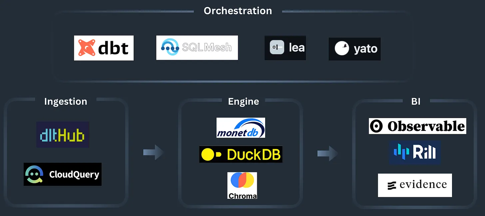
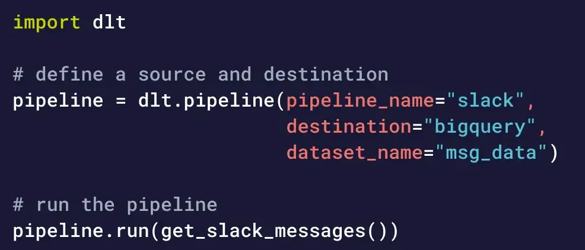
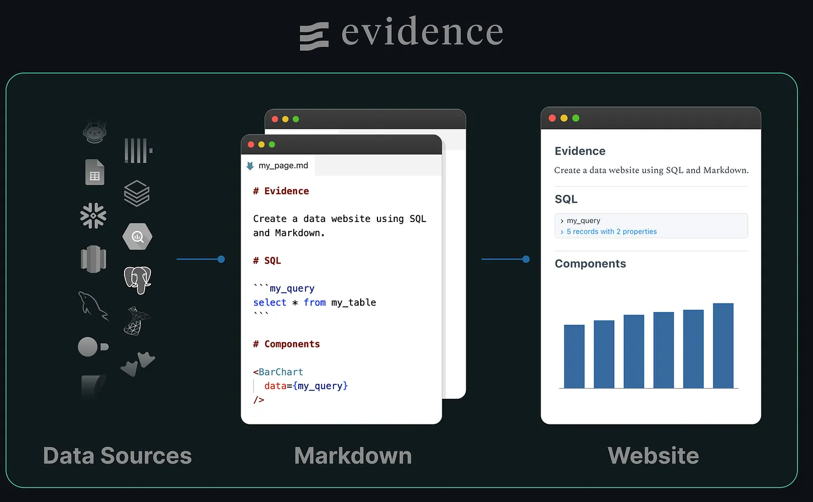
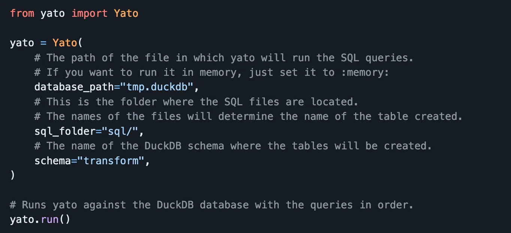
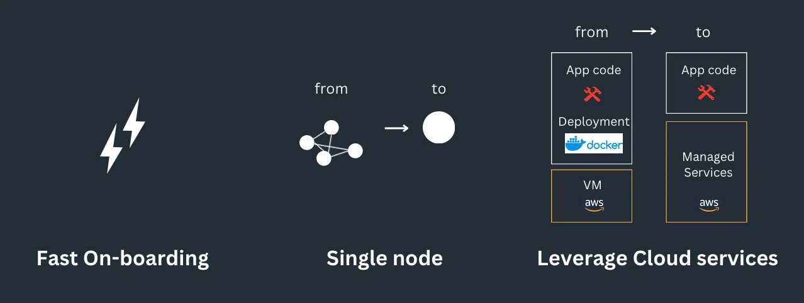
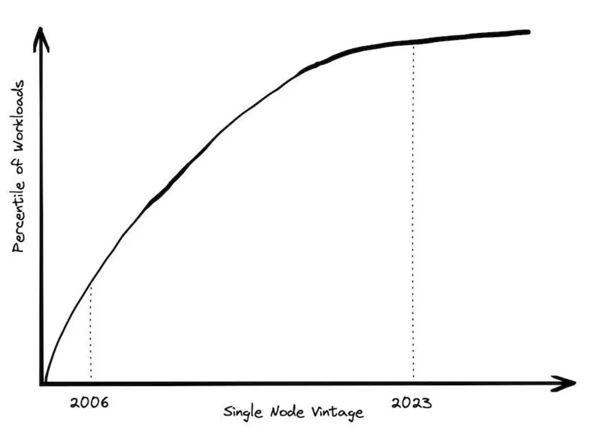

## The Pip install data stack

На этой картинке я пытался показать инструменты для "data stack", которые можно установить одной командой

### Ingestion

Airbyte и Meltano — известные всем инструменты с открытым исходным кодом в этой области.

Они предлагают значительные возможности, но их может быть сложно начать использовать, особенно если деплоем занимаетесь вы сами.

Новая волна ELT, упакованных в виде библиотек, появляется благодаря таким инструментам, как DLT и Cloudquery.

Даже Airbyte предоставляют Pyaribyte, где вы можете использовать некоторые коннекторы Airbyte, загруженные как библиотеки Python.

Эти инструменты позиционируют себя между *no-code ELTs* и подходами с большим *code-heavy*.

Они менее мощны, чем их аналоги (меньше разъемов, нет триггеров dbt и планировщика), но они намного легче и ими проще манипулировать.

Конкурентное преимущество ELT часто заключается в разнообразии предлагаемых ими коннекторов.

Однако ни один инструмент не может охватить все возможные соединения.

В этом отношении легковесные инструменты имеют преимущество, поскольку они легко совместимы с разными источникми данных.

Эта гибкость позволяет вам легко переключать инструменты, если один из них не идеален для конкретного источника данных: просто добавьте строку в файл requirements.txt.

### SQL Engines

*pip wave* также распространяется на базы данных с такими движками, как **DuckDB** и **CometDB**.

Такой вариант распространения позволяет встраивать их куда угодно: в *notebook*, *отдельный скрипт* и даже в браузер.

Нет необходимости управлять отдельным сервером для вашей базы данных, все работает там, где работает ваш код.

Здесь легкость и простота также имеют приоритет над масштабом, нет необходимости управлять сервером, доступно множество интеграций, и он может легко взаимодействовать с другими платформами.

Эти механизмы являются одноузловыми, поэтому они ограничены размером экземпляра, на котором они работают. Они не масштабируются, как их распределенные аналоги, они просто созданы для случаев, когда бесконечная масштабируемость не требуется.

### BI: BI as code

Традиционные BI инструменты, такие как Tableau, могут быть громоздкими. 
Несколько клиентских интерфейсов (облако/рабочий стол), невоспроизводимые дашборды с возможностью перетаскивания и отсутствие тестовой среды.

Появляются новые инструменты с другой философией: *npm installable* и *as code*..

Что касается любого подхода *as code*, он обеспечивает простое управление версиями, тестирование в средах разработки и автоматическое развертывание через CI.

Кроме того, они генерируют простые статические веб-страницы, которые вы можете очень легко разместить самостоятельно (на S3?).

И здесь компромисс очевиден: простота и легкость против военной машины BI.

### Orchestration: run SQL transformations

dbt является явным лидером в этой категории.

Несмотря на то, что он мощный, его установка и обслуживание могут оказаться немного сложными.

Появляется новая волна еще более легких инструментов.

**SQLMesh**, **Lea** и **Yato** — два таких инструмента, использующие возможности синтаксического анализа SQL *SQLGlot*, которые устраняют необходимость вручную записывать *{{ ref() }}* между моделями.

Вы просто предоставляете им папку, полную *моделей* SQL, и они автоматически определяют выполнение DAG.

Например, **Yato** загружает файл резервной копии DuckDB из S3, извлекает граф SQL из SQLGlot, выполняет запрос в DuckDB и сохраняет его в S3.

Возможности Yato ограничены, но достаточны для запуска многих небольших приложений по работе с данными.

Вместо настройки полного проекта dbt для простого приложения для обработки данных напишите SQL-запросы в файле, запустите файл .py, и данные будут преобразованы и готовы к использованию.

Простой. Эффективный.

## Что делает эти инструменты популярными?

### Easy onboarding

Хотя Docker является отличным инструментом для тестирования и прототипирования, многие разработчики считают контейнеры достаточно сложными и отказываются от их использования.

В этом основное отличие инструментов устанавливаемых в одну команду.

В конце концов, инструменты обработки данных похожи на любой другой продукт: они должны позволять пользователям быстро и легко приступить к работе.

Эти первые моменты использования инструмента, подобные первому впечатлению пользователя от веб-страницы, сильно влияют на мнение о ней разработчика.

Подобно покупке в 1 клик на Amazon, нам нужно больше: «Запустите сейчас с установкой в ​​1 пункт».

### Lightweight: Single node stack

Ограничением этого стека данных, конечно же, является масштаб.

Однако, это может помочь многим командам создавать действительно простые продукты данных.

Сегодня вы можете арендовать *большие виртуальные машины* с минимальными затратами, что делает эти решения жизнеспособными для многих вариантов использования.

В конце концов, во многих бизнес-сценариях вам, вероятно, редко потребуется запрашивать более 10 ГБ одновременно для запуска дашборда.

### Cloud managed services

Что хорошо в тенденции использования pip install, так это то, насколько легко она интегрируется повсюду, особенно с *managed services* облачных провайдеров.

Snowflake инициировала эту тенденцию, построив свое облочное хранилище на базе S3.

*pip install wave* продолжает двигаться в этом направлении, где инструменты сосредотачиваются на своем уникальном коде, оставляя периферийные функции управляемым сервисам, поддерживаемым сотнями инженеров облачных сервисов.

Посмотрим на ETL пример:

Вместо настройки Airbyte в кластере Kubernetes вы можете запустить dlt внутри лямбды:
 - Logging and observability осуществляются CloudWatch
 - Retry с помощью Step Functions
 - Управление состоянием DynamoDB

Подобно тому, как Snowflake использует доступность данных S3 на уровне 99,99% и надежность на уровне 99,999999999%, все эти функции могут использовать разработчики инструментов обработки данных без необходимости их пересборки, по сути получая их «бесплатно».