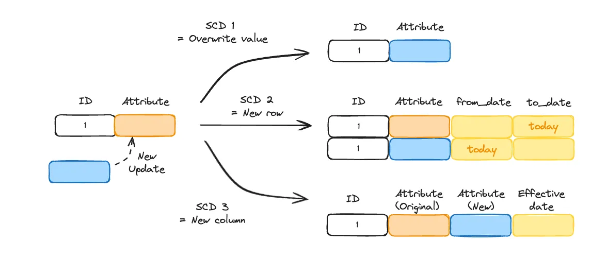
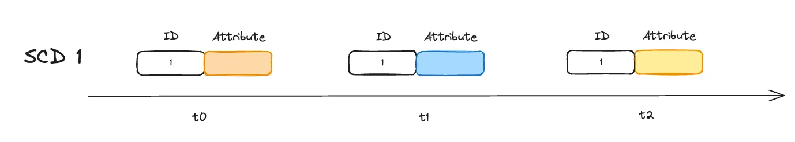
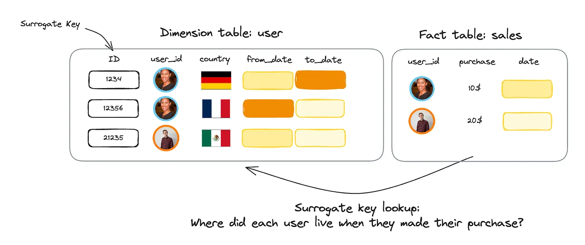
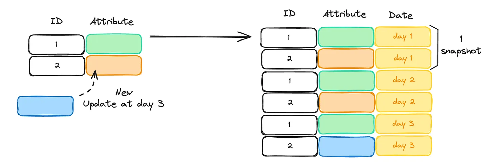

## SCDs?

Slowly Changing Dimensions (SCD) используются для обработки изменения данных с течением времени.
Наиболее распространенными типами являются SCD типа 1, 2 и 3.

Вот краткий обзор того, как они работают, когда необходимо записать новую версию записи:

• Тип SCD 1: перезаписывает строку новым значением.

• Тип SCD 2: добавляет новую строку с новым значением.

• Тип SCD 3: добавляет новый столбец с новым значением.



### 🫸 SCD 1 & 3

SCD 1 и 3 перезаписывают данные, предполагая, что записи изменяемы.
И это проблема.

Обычно дата-инженеры предпочитают считать данные неизменяемыми, они расчитывают, что пайплайн будет *идемпотентным* и запустив расчет дага за прошлое число он не *сломает* данные в конечных таблицах.

Представьте, что мы выполняем обновление SCD1 три раза в моменты времени t0, t1 и t2.
К сожалению, мы обнаружили, что значение было неправильным, однако оно использовалось для вычисления нисходящей метрики.



Теперь мы получили его исправленную версию.

Как мы можем исправить нисходящую метрику?
Это очень сложно, если не невозможно и следовательно, невозможно сделать наш конвейер *идемпотентным*.

### 🧠 SCD 2

SCD 2, кажется, отвечает всем требованиям: не теряет информацию, идемпотентен и сжимает данные.
Но есть одна загвоздка.
Им трудно манипулировать.
Во-первых, чтение фактических данных сложнее из-за так называемого «поиска суррогатного ключа».

Давайте возьмем пример SCD2:

• Таблица измерений содержит страну пользователя.
Адреса со временем меняются и имеют период действия from_date и to_date. Суррогатным ключом является комбинация пользователя, адреса и периода действия.

• Таблица фактов содержит исторические покупки каждого пользователя.



Теперь мы хотим посчитать количество продаж в каждой стране для нашего отдела маркетинга.

Запрос будет выглядеть следующим образом:

```sql
With user_sales as (
   SELECT * 
   FROM sales s
   JOIN user u ON 
   s.user_id = u.user_id
   AND s.date > u.from_date
   AND s.date <= u.to_date
)
select country, sum(purchase)
from user_sales
group by country 
```

Проблема с таким поиском заключается в том, что производительность джоина может быть не эффективной, если выходные данные используются в BI инструменте.

Более того, таблицы могли быть отключены из-за несинхронизации процессов ETL между источником и системами аналитики.

В таких случаях вы должны убедиться, что в таблице измерений существует суррогатный ключ, и установить процесс разрешения, если его нет.

Это делает загрузку таких таблиц фактов подверженной ошибкам и затрудняет ее управление.
Кроме того, проверка правильности SCD2 может оказаться сложной.
Например, вам может потребоваться убедиться, что интервалы from_date, to_date не перекрываются.
Написание такого запроса может быть нетривиально (кстати, хороший вопрос для собеседования по SQL).

### 🎯 Snapshot table

Альтернативный подход — использование snapshot таблиц.

Концепция snapshot таблицы заключается в полной репликации таблицы измерений при каждом запланированном запуске ETL.

Если ETL запускается каждый день, snapshot таблица будет выглядеть следующим образом:



Да, это большая репликация данных.
Но ментальная модель гораздо проще.
И теперь, количество продаж по запросу страны будет выглядеть следующим образом:

```sql
With user_sales as (
   SELECT * 
   FROM sales s
   JOIN user u ON 
   s.user_id = u.user_id
   and u.date = s.date
)
select country, sum(purchase)
from user_sales
group by country 
```

Что гораздо проще понять.
Модель также обладает высокой воспроизводимостью.

Исправить историческую версию записи очень просто: воспроизведите пайплайн ETL для определенного раздела (в данном случае дня).

Никаких головных болей.
А в мире, где время разработки гораздо более ценно, чем затраты на хранение, имеет смысл использовать больше места для хранения данных и меньше времени для разработки.
Однако есть несколько случаев, когда подход snapshot таблиц достигает своего предела.
Рассмотрим наш пользовательский пример, упомянутый ранее.
Если мы хотим рассчитать среднее время пребывания пользователей в стране, SCD2 вполне удобен:

```sql
SELECT sum(to_date - from_date)/count(*)
FROM users
```

Сделать это с помощью snapshot таблиц было бы сложнее.
Как всегда, один подход не может охватить все варианты использования.
Однако снимки обычно предлагают более простой способ моделирования SCD.

Благодаря cloud warehouse, разделяющим хранилище и вычисления, мы больше не ограничены в объеме хранилища так, как это было в предыдущих поколениях хранилищ.

И это компромисс, который мы должны помнить при проектировании конвейеров:

>Перерасход ресурсов на более простое решение часто быстро компенсируется меньшими затратами времени на его поддержку.